# Design Document

## Overview

`paperquay-agent-zotero` adds PRD Phase 4 on top of the completed Phase 1 (library shell), Phase 2 (reader + metadata), and Phase 3 (structured blocks + cached translation):

1. **Library Agent workspace** — A controlled Agent that inspects the local paper library via bounded read-only tools, proposes metadata/category/tag/reading-state operations, requires human confirmation before any write, executes approved operations, and preserves a durable audit trail with optional revert.
2. **Read-only Zotero import flow** — Copies a user-selected `zotero.sqlite` to a temporary workspace, previews import candidates, maps collections/tags/metadata/attachments into the existing library model, detects duplicates, and imports only after explicit user confirmation.

The design preserves the current FastAPI + SQLModel + SQLite + React/Vite architecture. It does not copy PaperQuay source code or adopt Tauri/Rust. All write operations are explicit, reversible where practical, and auditable.

## Steering Document Alignment

### Technical Standards

No steering documents exist in `.spec-workflow/steering`, so this design follows repository conventions visible in existing code:

- SQLModel table classes under `backend/app/models`, registered in `__init__.py` and imported in `main.py`.
- FastAPI route modules under `backend/app/api/routes`, imported in `main.py` with the existing `protected_dependencies` auth guard.
- Service-level business logic under `backend/app/services`.
- Pydantic request/response schemas under `backend/app/schemas`.
- Frontend API wrappers in `frontend/src/lib/api.ts` using `readJson` and `getAuthHeaders`.
- Focused React components under `frontend/src/components/{domain}/`, receiving data/handlers via props.
- Route-level integration coverage in `frontend/src/App.test.tsx`.
- Backend tests under `backend/tests/` with focused fixture coverage.
- New files kept under ~300 lines; large surfaces split into hooks, utilities, and presentational components.

### Project Structure

New Agent and Zotero code is intentionally separated from existing papers/reader/chat modules:

| Domain | Backend Models | Backend Schemas | Backend Services | Backend Routes |
|---|---|---|---|---|
| Agent | `agent_run.py`, `agent_tool_event.py`, `agent_action.py` | `agent.py` | `agent_tool_registry.py`, `agent_proposal_service.py`, `agent_runner_service.py` | `agent.py` |
| Zotero | `zotero_import_run.py`, `zotero_import_candidate.py` | `zotero.py` | `zotero_source_service.py`, `zotero_mapping_service.py`, `zotero_import_service.py` | `zotero.py` |

## Code Reuse Analysis

### Existing Components to Leverage

- **`Paper`**, **`PaperContent`**, **`PaperSummary`**, **`PaperBlock`**, **`PaperBlockTranslation`**: Agent read-only tools query these models. Agent write actions update `Paper` fields through existing update paths.
- **`Category`**, **`category_service.py`**: Agent may create non-system categories and assign papers to categories via `update_paper_category`. Zotero collections may be mapped to existing or new categories.
- **`DeepSeekClient`**: Reused for Agent model calls via `DeepSeekClient.chat()`. The Agent runner composes a library-aware system prompt with tool results and asks the model to propose structured actions. Agent prompts SHALL NOT accept arbitrary frontend-supplied system instructions.
- **`get_current_user`** auth dependency: All new Agent and Zotero routes reuse the same `protected_dependencies` list in `main.py`.
- **`StorageService`**: Zotero import reuses existing storage behavior for PDF attachments. Temporary Zotero DB copies use separate temp directories.
- **`PaperPipelineService.parse_paper`**: After Zotero import, imported PDFs may optionally trigger parse. This is controlled per import run.
- **`BackgroundTaskQueue`**: Reused for asynchronous Zotero scan/import tasks when the library is large.
- **`frontend/src/lib/api.ts`**: All new frontend calls go through typed API wrappers using `readJson` and `getAuthHeaders`.
- **Existing CSS tokens**: Agent/Zotero styling reuses the existing data-dense workspace design tokens.

### Integration Points

- **Agent runner ↔ DeepSeek**: Agent runner builds a bounded system prompt containing scope info, tool specification, and library context; calls `DeepSeekClient.chat()`; parses the model's response for structured proposals.
- **Agent proposals ↔ Paper/Category writes**: `agent_proposal_service` validates targets, executes approved writes through existing `update_paper_category`, paper PATCH paths, and tag update behavior.
- **Zotero source ↔ temp workspace**: `zotero_source_service` copies the user-provided `zotero.sqlite` to a temp workspace and opens it read-only. The original file is never modified.
- **Zotero mapping ↔ Paper creation**: `zotero_import_service` maps scanned candidates into `Paper` records, reusing `StorageService` for PDF attachments and existing paper creation patterns.
- **Database migration**: New tables (`agent_run`, `agent_tool_event`, `agent_action`, `zotero_import_run`, `zotero_import_candidate`) are created by SQLModel metadata with `create_all`. No columns are added to existing tables.

## Architecture

```mermaid
flowchart TD
  subgraph Agent
    User[User prompt + scope] --> AgentRoute[POST /agent/runs]
    AgentRoute --> Runner[AgentRunnerService]
    Runner --> Tools[AgentToolRegistry<br/>read-only library tools]
    Runner --> LLM[DeepSeekClient]
    LLM --> Parse[Parse structured proposals]
    Parse --> Store[Store AgentRun + AgentAction + AgentToolEvent]
    Store --> UI[Proposal review UI]
    UI -->|approve| Approve[POST /agent/actions/:id/approve]
    UI -->|batch| BatchApprove[POST /agent/runs/:id/approve-batch]
    UI -->|reject| Reject[POST /agent/actions/:id/reject]
    UI -->|revert| Revert[POST /agent/actions/:id/revert]
    Approve --> Execute[AgentProposalService.execute]
    BatchApprove --> Execute
    Revert --> Execute
    Execute --> Audit[Audit events]
  end

  subgraph Zotero
    ZUser[Source path] --> ScanRoute[POST /zotero/import-runs/scan]
    ScanRoute --> Source[ZoteroSourceService<br/>validate + copy to temp]
    Source --> Mapper[ZoteroMappingService<br/>parse items/creators/tags/collections/attachments]
    Mapper --> Dedupe[ZoteroImportService<br/>dedupe + warnings]
    Dedupe --> Preview[Preview candidates UI]
    Preview -->|select + confirm| Import[POST /zotero/import-runs/:id/import]
    Import --> Paper[Create Paper records]
  end
```



### Modular Design Principles

- **Route separation**: Agent routes live in `agent.py`; Zotero routes live in `zotero.py`; neither extends the already-large `papers.py`.
- **Service encapsulation**: Read-only tools, proposal validation/execution, Agent runner, Zotero source safety, mapping, and import are each in a dedicated service class.
- **Proposal-first writes**: The Agent never writes directly. Every write is a stored proposal that requires human confirmation.
- **Audit durability**: Every Agent run, tool call, proposed action, approval, execution, rejection, and revert creates a durable audit record.
- **Zotero safety**: Original Zotero DB is never opened for write. All reads happen on a temporary copy.
- **Per-candidate resilience**: Zotero mapping tolerates malformed individual records; import failures do not stop independent candidates.

## Components and Interfaces

### Backend Model: `AgentRun`

- **Purpose**: Persist durable metadata for each Agent run.
- **Location**: `backend/app/models/agent_run.py`
- **Fields**: id, prompt, scope_type (whole_library / category / papers / reader_paper), scope_config JSON, model, status (pending / running / completed / failed), linked_chat_session_id, created_at, updated_at.
- **Dependencies**: Optional FK to `ChatSession`.
- **Reuses**: SQLModel timestamp pattern, ChatSession linkage pattern.

### Backend Model: `AgentToolEvent`

- **Purpose**: Record bounded tool call traces for an Agent run.
- **Location**: `backend/app/models/agent_tool_event.py`
- **Fields**: id, agent_run_id, tool_name, input_summary, output_summary, status (success / error), error_message, created_at.
- **Dependencies**: FK to `AgentRun`.
- **Reuses**: SQLModel timestamp pattern.

### Backend Model: `AgentAction`

- **Purpose**: Persist proposed, approved, executed, rejected, and reverted actions with before/after values and audit chain.
- **Location**: `backend/app/models/agent_action.py`
- **Fields**: id, agent_run_id, action_type (update_paper_metadata / update_tags / update_category / create_category / assign_category), target_paper_id, target_category_id, before_values JSON, after_values JSON, rationale, confidence, risk_level (low / medium / high / irreversible), status (proposed / approved / executed / rejected / failed / reverted), revert_action_id (links revert to original), rejection_reason, error_message, created_at, updated_at.
- **Dependencies**: FK to `AgentRun`; optional FK to `Paper` and `Category`.
- **Reuses**: SQLModel pattern, update paper/category patterns.

### Backend Model: `ZoteroImportRun`

- **Purpose**: Persist import run metadata with source fingerprint and result counts.
- **Location**: `backend/app/models/zotero_import_run.py`
- **Fields**: id, source_fingerprint (SHA256 of source path), status (scanning / ready / importing / completed / failed / cancelled), imported_count, skipped_count, duplicate_count, warning_count, failed_count, error_message, created_at, updated_at.
- **Dependencies**: None (standalone run record).
- **Reuses**: SQLModel timestamp pattern, pipeline status pattern.

### Backend Model: `ZoteroImportCandidate`

- **Purpose**: Persist each scanned Zotero item as a preview candidate with dedupe and result state.
- **Location**: `backend/app/models/zotero_import_candidate.py`
- **Fields**: id, import_run_id, source_key (Zotero item key), zotero_item_type, raw_title, mapped_title, mapped_authors, mapped_year, mapped_doi, mapped_url, mapped_venue, mapped_abstract_note, mapped_publication_title, mapped_collections JSON, mapped_tags JSON, attachment_path, attachment_exists, is_duplicate, duplicate_of_paper_id, duplicate_reason, is_selected (default depends on duplicate), warning_message, import_status (pending / imported / skipped / failed), imported_paper_id, import_error, created_at.
- **Dependencies**: FK to `ZoteroImportRun`; optional FK to `Paper` for duplicate matches and imported papers.
- **Reuses**: SQLModel pattern, paper metadata fields.

### Backend Service: `AgentToolRegistry`

- **Purpose**: Provide bounded read-only library tools for the Agent.
- **Location**: `backend/app/services/agent_tool_registry.py`
- **Interfaces**:
  - `list_papers(session, scope, filters) -> ToolResult` — bounded by record count, returns title/id/status/year/reading_status/favorite, no full text.
  - `get_paper_detail(session, paper_id) -> ToolResult` — returns metadata, summary short, category, tags, block type counts, reading state; no full markdown, no local path, no API keys.
  - `list_categories(session) -> ToolResult` — returns category names, IDs, and paper counts.
  - `list_tags(session) -> ToolResult` — returns distinct tags from library.
  - `get_paper_blocks(session, paper_id) -> ToolResult` — returns block type/page summary, bounded text snippets, no source_json.
  - `get_paper_translations(session, paper_id) -> ToolResult` — returns translation status summary.
  - `semantic_search(session, query, top_k) -> ToolResult` — returns bounded paper matches with similarity scores.
- **Dependencies**: Session, existing `Paper`/`PaperContent`/`PaperBlock`/`PaperBlockTranslation`/`Category`/`PaperEmbedding` queries.
- **Safety**: All results omit local_pdf_path, API credentials, raw source_json, and unbounded full-text content. Results include truncation indicators when bounded.

### Backend Service: `AgentProposalService`

- **Purpose**: Validate proposed actions, execute approved writes, handle rejection and revert.
- **Location**: `backend/app/services/agent_proposal_service.py`
- **Interfaces**:
  - `validate_proposal(session, action: AgentAction) -> AgentAction` — checks target exists, action type is allowed, before/after values are present.
  - `execute_action(session, action: AgentAction) -> AgentAction` — performs the write through existing paper/category update services, records after values.
  - `reject_action(session, action: AgentAction, reason: str) -> AgentAction` — marks rejected with optional reason.
  - `revert_action(session, action: AgentAction) -> AgentAction` — restores before values if target hasn't changed since execution; creates new linked audit event.
  - `batch_execute(session, actions: list[AgentAction]) -> BatchResult` — executes independent actions; skips actions dependent on failed predecessors.
- **Dependencies**: `update_paper_category`, paper PATCH patterns, tag update behavior, `category_service.create_category`.
- **Safety**: Blocks destructive actions (delete paper, delete files, modify paths, trigger parse/summarize/embed/translate). Validates target freshness before revert.

### Backend Service: `AgentRunnerService`

- **Purpose**: Compose Agent prompt with scope, call model, parse structured proposals into stored actions.
- **Location**: `backend/app/services/agent_runner_service.py`
- **Interfaces**:
  - `create_run(session, prompt: str, scope: dict, model: str, chat_session_id: int | None) -> AgentRun`
  - `execute_run(session, run: AgentRun) -> list[AgentAction]` — calls tools, composes prompt, calls DeepSeekClient, parses response, stores actions.
  - `build_system_prompt(scope, tools_spec) -> str` — builds library-aware system prompt with scope context and tool capability descriptions.
  - `parse_model_response(response_text: str) -> list[ProposedAction]` — extracts structured proposals from model output; handles JSON repair.
- **Dependencies**: `AgentToolRegistry`, `DeepSeekClient.chat()`, `AgentAction` model.
- **Safety**: Model system prompt is server-composed; frontend cannot inject system instructions. Model response JSON is validated before action creation. Malformed responses produce a failed run with error detail, not corrupted actions.

### Backend API: `agent.py`

- **Purpose**: Expose Agent run, proposal, approval, rejection, and revert endpoints.
- **Location**: `backend/app/api/routes/agent.py`
- **Interfaces**:
  - `POST /agent/runs` — create a new Agent run with prompt and scope; execute synchronously or queue for background processing.
  - `GET /agent/runs` — list recent runs with status and summary counts.
  - `GET /agent/runs/{run_id}` — get run detail, tool events, proposals, and execution summary.
  - `POST /agent/actions/{action_id}/approve` — approve and execute a single proposal.
  - `POST /agent/runs/{run_id}/approve-batch` — approve a batch after final confirmation; returns applied/skipped/failed/rejected counts.
  - `POST /agent/actions/{action_id}/reject` — reject a proposal with optional reason.
  - `POST /agent/actions/{action_id}/revert` — revert a reversible applied action after confirmation.
- **Dependencies**: `get_current_user` auth, `get_session`, Agent services.
- **Reuses**: Route registration pattern from `main.py` (`protected_dependencies`).

### Backend Service: `ZoteroSourceService`

- **Purpose**: Validate Zotero source file, copy to temp workspace, provide read-only SQLite connection.
- **Location**: `backend/app/services/zotero_source_service.py`
- **Interfaces**:
  - `validate_source(source_path: str) -> SourceInfo` — checks existence, file type, readability, SQLite header; returns fingerprint.
  - `create_temp_copy(source_path: str) -> Path` — copies `zotero.sqlite` to temp directory.
  - `open_read_only(db_path: Path) -> Connection` — opens read-only SQLite connection on the temp copy.
  - `cleanup_temp_copy(db_path: Path)` — deletes temp copy after import completes or is cancelled.
- **Dependencies**: `pathlib`, `sqlite3`, `tempfile`.
- **Safety**: Original Zotero DB is never opened for write. Temp copies are cleaned up when safe.

### Backend Service: `ZoteroMappingService`

- **Purpose**: Parse Zotero SQLite rows into normalized import candidates.
- **Location**: `backend/app/services/zotero_mapping_service.py`
- **Interfaces**:
  - `scan_items(conn: Connection) -> list[ZoteroItem]` — queries Zotero items, itemData, creators, collections, tags, itemAttachments from the temp DB.
  - `map_candidate(item: ZoteroItem) -> CandidatePayload` — flattens creators into authors string, normalizes date/year, maps collections/tags, identifies PDF attachments.
  - `check_attachment(path: str) -> bool` — verifies local attachment file exists.
- **Dependencies**: `sqlite3`, existing paper metadata conventions.
- **Safety**: Unsupported item types are added to a warning/skipped list. Malformed individual rows are tolerated.

### Backend Service: `ZoteroImportService`

- **Purpose**: Build preview candidates, detect duplicates, execute confirmed import.
- **Location**: `backend/app/services/zotero_import_service.py`
- **Interfaces**:
  - `build_candidates(session, run, items) -> list[ZoteroImportCandidate]` — creates candidate records with dedupe state.
  - `detect_duplicates(session, candidate) -> DuplicateResult` — compares by DOI, normalized title, URL against existing papers.
  - `import_candidates(session, run, candidates, allow_metadata_only: bool) -> ImportResult` — creates Paper records for selected candidates, imports PDF attachments, records per-candidate results.
- **Dependencies**: `StorageService`, paper creation patterns, `ZoteroImportRun`, `ZoteroImportCandidate`.
- **Safety**: Duplicates default to unselected. Metadata-only imports require explicit permission. Per-candidate failures do not stop other candidates.

### Backend API: `zotero.py`

- **Purpose**: Expose Zotero scan, preview, candidate selection, and confirmed import endpoints.
- **Location**: `backend/app/api/routes/zotero.py`
- **Interfaces**:
  - `POST /zotero/import-runs/scan` — validate source, copy DB, scan candidates, return run id; may queue background task.
  - `GET /zotero/import-runs/{run_id}` — get run summary and candidate counts.
  - `GET /zotero/import-runs/{run_id}/candidates` — paged/filterable preview by collection, tag, attachment status, duplicate status, warning status.
  - `PATCH /zotero/import-runs/{run_id}/candidates/{candidate_id}` — update selected state.
  - `POST /zotero/import-runs/{run_id}/import` — import selected candidates after final confirmation.
- **Dependencies**: `get_current_user` auth, `get_session`, Zotero services.
- **Reuses**: Route registration pattern, `protected_dependencies`.

### Backend Schemas

#### `schemas/agent.py`

```python
class AgentScopeConfig(BaseModel):
    scope_type: str                   # whole_library / category / papers / reader_paper
    category_id: int | None = None
    paper_ids: list[int] = []

class AgentRunCreate(BaseModel):
    prompt: str
    scope: AgentScopeConfig
    model: str = "gpt-5.4"
    chat_session_id: int | None = None

class AgentToolEventResponse(BaseModel):
    id: int
    tool_name: str
    input_summary: str
    output_summary: str
    status: str
    error_message: str

class AgentActionResponse(BaseModel):
    id: int
    agent_run_id: int
    action_type: str
    target_paper_id: int | None
    target_category_id: int | None
    before_values: dict
    after_values: dict
    rationale: str
    confidence: float
    risk_level: str
    status: str
    revert_action_id: int | None
    rejection_reason: str
    error_message: str

class AgentRunResponse(BaseModel):
    id: int
    prompt: str
    scope: AgentScopeConfig
    model: str
    status: str
    chat_session_id: int | None
    actions: list[AgentActionResponse]
    tool_events: list[AgentToolEventResponse]
    created_at: str
    updated_at: str

class BatchApproveRequest(BaseModel):
    action_ids: list[int]

class BatchApproveResponse(BaseModel):
    applied: int
    skipped: int
    failed: int
    rejected: int

class RejectRequest(BaseModel):
    reason: str = ""
```

#### `schemas/zotero.py`

```python
class ZoteroScanRequest(BaseModel):
    source_path: str

class ZoteroRunResponse(BaseModel):
    id: int
    source_fingerprint: str
    status: str
    imported_count: int
    skipped_count: int
    duplicate_count: int
    warning_count: int
    failed_count: int
    created_at: str
    updated_at: str

class ZoteroCandidateResponse(BaseModel):
    id: int
    import_run_id: int
    source_key: str
    mapped_title: str
    mapped_authors: str
    mapped_year: int | None
    mapped_doi: str
    mapped_url: str
    mapped_venue: str
    mapped_collections: list[str]
    mapped_tags: list[str]
    attachment_exists: bool
    is_duplicate: bool
    duplicate_of_paper_id: int | None
    duplicate_reason: str
    is_selected: bool
    warning_message: str
    import_status: str

class ZoteroCandidateFilter(BaseModel):
    collection: str | None = None
    tag: str | None = None
    attachment_status: str | None = None   # all / with_attachment / without_attachment
    duplicate_status: str | None = None    # all / duplicate / unique
    warning_status: str | None = None      # all / warning / no_warning

class ZoteroImportConfirm(BaseModel):
    allow_metadata_only: bool = False

class CandidateSelectUpdate(BaseModel):
    is_selected: bool
```

### Frontend API Wrappers

- **Location**: `frontend/src/lib/api.ts`
- **New functions**:
  - `createAgentRun(payload) -> AgentRunResponse`
  - `fetchAgentRuns() -> AgentRunResponse[]`
  - `fetchAgentRunDetail(runId) -> AgentRunResponse`
  - `approveAgentAction(actionId) -> AgentActionResponse`
  - `batchApproveAgentActions(runId, actionIds) -> BatchApproveResponse`
  - `rejectAgentAction(actionId, reason?) -> AgentActionResponse`
  - `revertAgentAction(actionId) -> AgentActionResponse`
  - `scanZotero(sourcePath) -> ZoteroRunResponse`
  - `fetchZoteroRun(runId) -> ZoteroRunResponse`
  - `fetchZoteroCandidates(runId, filters?) -> ZoteroCandidateResponse[]`
  - `updateCandidateSelection(runId, candidateId, selected) -> ZoteroCandidateResponse`
  - `importZoteroCandidates(runId, confirm) -> ZoteroRunResponse`

### Frontend Agent Components

- **`AgentWorkspace.tsx`** — Root Agent component: scope picker, prompt input, run trigger, trace panel, proposal list, batch confirmation, execution result.
- **`AgentScopePicker.tsx`** — Scope selection: whole library, category dropdown, paper multi-select, or auto-detect from reader.
- **`AgentTracePanel.tsx`** — Collapsible tool trace panel showing which data was consulted.
- **`AgentProposalList.tsx`** — Grouped proposal list by risk and action type; per-proposal approve/reject/expand; batch footer.
- **`agentUtils.ts`** — Type guards, risk level labels/colors, action type labels, scope serialization helpers.

### Frontend Zotero Components

- **`ZoteroImportPage.tsx`** — Root import component: source form, scan trigger, candidate table, filters, import confirmation, progress, report.
- **`ZoteroSourceForm.tsx`** — Source path input with validation feedback and scan button.
- **`ZoteroCandidateTable.tsx`** — Table with row selection, column display, filter controls, duplicate/warning indicators.
- **`ZoteroImportSummary.tsx`** — Post-import summary with counts and per-candidate results.
- **`zoteroUtils.ts`** — Candidate sort/filter helpers, status labels, duplicate reason display.

### Frontend Route Integration

- Agent route: `/agent` renders `AgentWorkspace` with a workspace header.
- Zotero route: `/zotero/import` renders `ZoteroImportPage` with a workspace header.
- `App.tsx` adds both routes and sidebar nav entries.
- Existing routes (`/`, `/paper/:paperId`, `/paper/:paperId/reader`, `/briefing`, `/assistant`, `/recommendation`, `/stats`, `/subscribe`) are preserved.

## Data Models

### `AgentRun`

```python
class AgentRun(SQLModel, table=True):
    id: int | None = Field(default=None, primary_key=True)
    prompt: str = ""
    scope_type: str = Field(default="whole_library", index=True)
    scope_config_json: str = "{}"
    model: str = Field(default="gpt-5.4", index=True)
    status: str = Field(default="pending", index=True)
    chat_session_id: int | None = Field(default=None, foreign_key="chatsession.id")
    created_at: datetime = Field(default_factory=utcnow)
    updated_at: datetime = Field(default_factory=utcnow)
```

### `AgentToolEvent`

```python
class AgentToolEvent(SQLModel, table=True):
    id: int | None = Field(default=None, primary_key=True)
    agent_run_id: int = Field(index=True, foreign_key="agentrun.id")
    tool_name: str = Field(index=True)
    input_summary: str = ""
    output_summary: str = ""
    status: str = Field(default="success")
    error_message: str = ""
    created_at: datetime = Field(default_factory=utcnow)
```

### `AgentAction`

```python
class AgentAction(SQLModel, table=True):
    id: int | None = Field(default=None, primary_key=True)
    agent_run_id: int = Field(index=True, foreign_key="agentrun.id")
    action_type: str = Field(index=True)
    target_paper_id: int | None = Field(default=None, foreign_key="paper.id", index=True)
    target_category_id: int | None = Field(default=None, foreign_key="category.id")
    before_values_json: str = "{}"
    after_values_json: str = "{}"
    rationale: str = ""
    confidence: float = Field(default=0.0)
    risk_level: str = Field(default="low", index=True)
    status: str = Field(default="proposed", index=True)
    revert_action_id: int | None = None
    rejection_reason: str = ""
    error_message: str = ""
    created_at: datetime = Field(default_factory=utcnow)
    updated_at: datetime = Field(default_factory=utcnow)
```

### `ZoteroImportRun`

```python
class ZoteroImportRun(SQLModel, table=True):
    id: int | None = Field(default=None, primary_key=True)
    source_fingerprint: str = Field(index=True)
    status: str = Field(default="scanning", index=True)
    imported_count: int = 0
    skipped_count: int = 0
    duplicate_count: int = 0
    warning_count: int = 0
    failed_count: int = 0
    error_message: str = ""
    created_at: datetime = Field(default_factory=utcnow)
    updated_at: datetime = Field(default_factory=utcnow)
```

### `ZoteroImportCandidate`

```python
class ZoteroImportCandidate(SQLModel, table=True):
    id: int | None = Field(default=None, primary_key=True)
    import_run_id: int = Field(index=True, foreign_key="zoteroimportrun.id")
    source_key: str = Field(index=True)
    zotero_item_type: str = ""
    raw_title: str = ""
    mapped_title: str = ""
    mapped_authors: str = ""
    mapped_year: int | None = None
    mapped_doi: str = ""
    mapped_url: str = ""
    mapped_venue: str = ""
    mapped_abstract_note: str = ""
    mapped_publication_title: str = ""
    mapped_collections_json: str = "[]"
    mapped_tags_json: str = "[]"
    attachment_path: str = ""
    attachment_exists: bool = False
    is_duplicate: bool = False
    duplicate_of_paper_id: int | None = Field(default=None, foreign_key="paper.id")
    duplicate_reason: str = ""
    is_selected: bool = True
    warning_message: str = ""
    import_status: str = Field(default="pending", index=True)
    imported_paper_id: int | None = Field(default=None, foreign_key="paper.id")
    import_error: str = ""
    created_at: datetime = Field(default_factory=utcnow)
```

## Backend Flow

### Agent Run Flow

1. Frontend sends `POST /agent/runs` with prompt, scope, model.
2. `AgentRunnerService.create_run` creates an `AgentRun` record (status=pending).
3. `AgentRunnerService.execute_run` is called:
   a. Sets run status to `running`.
   b. Resolves scope: if `reader_paper`, extracts paper_id from current reader context; if `category`, filters papers by category; if `papers`, limits to selected IDs.
   c. Calls `AgentToolRegistry` tools to gather library context (papers listing, categories, tags, etc.).
   d. Records each tool call as an `AgentToolEvent` with bounded input/output summaries.
   e. Composes a system prompt with scope info, tool results, and action specification.
   f. Calls `DeepSeekClient.chat()` with the composed prompt and user's natural language prompt.
   g. Parses the model response for structured proposals.
   h. Creates `AgentAction` records for each valid proposal (status=proposed).
   i. Sets run status to `completed`; on model failure, sets status to `failed` with error detail.
4. Response returns the run with proposals; executions are NOT applied yet.

### Proposal Approval Flow

1. User reviews proposals in UI.
2. `POST /agent/actions/{action_id}/approve`:
   a. Validates the action is still proposed and target exists.
   b. Calls `AgentProposalService.execute_action`.
   c. Records before/after values on the action.
   d. Sets action status to `executed`.
   e. Returns updated action.
3. Batch approval `POST /agent/runs/{run_id}/approve-batch`:
   a. Validates all actions are proposed and targets exist.
   b. Shows final confirmation summary with counts by action type and risk level.
   c. Executes actions in dependency order.
   d. Independent actions continue after a sibling failure.
   e. Returns applied/skipped/failed/rejected counts.

### Revert Flow

1. `POST /agent/actions/{action_id}/revert`:
   a. Validates action is in `executed` status and is reversible.
   b. Checks target hasn't changed since execution (stale target check).
   c. If stale, returns confirmation requirement with current value.
   d. Restores before_values on the target paper/category.
   e. Creates a new `AgentAction` record (status=reverted) with `revert_action_id` pointing to original.

### Zotero Import Flow

1. Frontend sends `POST /zotero/import-runs/scan` with source path.
2. `ZoteroSourceService.validate_source` checks path exists, is file, is readable, has SQLite header.
3. `ZoteroSourceService.create_temp_copy` copies the DB to a temp workspace.
4. `ZoteroSourceService.open_read_only` opens the copy for reading.
5. `ZoteroMappingService.scan_items` queries items, creators, collections, tags, attachments.
6. `ZoteroMappingService.map_candidate` normalizes each item into a candidate payload.
7. `ZoteroImportService.build_candidates` creates `ZoteroImportCandidate` records with dedupe state:
   a. Compares by DOI, normalized title (case-insensitive, punctuation-insensitive), URL against existing papers.
   b. Defaults duplicates to `is_selected=False`.
   c. Checks attachment file existence, records warnings.
8. Run status transitions `scanning → ready`.
9. User reviews candidates via `GET /zotero/import-runs/{run_id}/candidates` with filters.
10. User updates selections via `PATCH /zotero/import-runs/{run_id}/candidates/{candidate_id}`.
11. `POST /zotero/import-runs/{run_id}/import`:
    a. Validates `allow_metadata_only` flag.
    b. For each selected candidate with attachment: reuses existing storage import behavior, creates Paper record.
    c. For each selected metadata-only candidate: creates Paper record only if `allow_metadata_only=True`.
    d. Records import_status per candidate (imported/skipped/failed).
    e. Updates run counts.
12. `ZoteroSourceService.cleanup_temp_copy` removes the temp DB copy (import audit records remain).

## Frontend Flow

### Agent Workspace

1. User navigates to `/agent`.
2. `AgentWorkspace` renders `AgentScopePicker` (default: whole library).
3. User selects scope, enters prompt, submits.
4. UI shows loading state with "Agent 正在分析你的论文库..." feedback.
5. On response: trace panel shows consulted tools, proposal list shows grouped actions.
6. User reviews proposals:
   - Expand individual proposals to see before/after values, rationale, confidence, risk level.
   - Approve single proposal → immediate feedback.
   - Reject single proposal → optional reason input.
   - Batch approve → final confirmation summary → execute.
   - Revert previously executed action → stale check → confirm restore.
7. Audit panel shows run history.

### Zotero Import

1. User navigates to `/zotero/import`.
2. `ZoteroSourceForm` accepts source path input.
3. User clicks "扫描" → progress indicator.
4. On scan complete: `ZoteroCandidateTable` shows all candidates with filters (collection, tag, attachment status, duplicate status, warning status).
5. Duplicate rows show "与已有论文重复" badge and default to unchecked.
6. User adjusts selections, reviews warnings.
7. User clicks "确认导入" → final confirmation with metadata-only toggle.
8. Import progress shows candidate-by-candidate status.
9. Final report shows imported/skipped/duplicate/warning/failed counts.

## Error Handling

1. **Agent model call fails**
   - **Handling**: Run status set to `failed`; any stored proposals are preserved as draft; error detail visible in UI.
   - **User Impact**: User can review the error and retry with adjusted prompt or model.

2. **Agent proposal targets stale or missing papers**
   - **Handling**: Validation before execution marks proposal `failed` with a "target not found" error.
   - **User Impact**: Proposal is shown as invalid; user can reject or address the reason.

3. **Batch execution partial failure**
   - **Handling**: Independent actions continue; dependent actions are skipped with reason.
   - **User Impact**: Results show applied/skipped/failed counts with per-action detail.

4. **Revert target changed since execution**
   - **Handling**: Shows current value and requires explicit user confirmation.
   - **User Impact**: Informed decision before overwriting newer data.

5. **Zotero source path invalid**
   - **Handling**: `POST /zotero/import-runs/scan` returns 422 with a structured error ("文件不存在", "不是有效的 SQLite 文件", "文件不可读").
   - **User Impact**: User sees a clear form error and can correct the path.

6. **Zotero DB locked or copy fails**
   - **Handling**: Returns 409 with message about the locked database (e.g., "Zotero 正在运行，请关闭后重试").
   - **User Impact**: User resolves the lock and retries.

7. **Zotero mapping encounters malformed records**
   - **Handling**: Malformed individual items are added to warning list; scan continues for other items.
   - **User Impact**: Preview shows warnings for specific items; other candidates remain importable.

8. **Zotero attachment file missing**
   - **Handling**: Candidate is kept with `attachment_exists=False` and warning; importable as metadata-only if allowed.
   - **User Impact**: Preview shows "附件文件缺失" badge.

9. **Auth failure**
   - **Handling**: Existing `readJson` unauthorized reporting path applies.
   - **User Impact**: Consistent with all other API routes.

10. **Model produces malformed proposal JSON**
    - **Handling**: Repair-parse attempt; if unrecoverable, run is marked failed with raw response snippet (sanitized) in error.
    - **User Impact**: User sees an "Agent 返回了无法解析的建议" message and can retry.

## Testing Strategy

### Unit Testing

- `agent_tool_registry` fixture tests:
  - Bounded paper listing (count, truncation, field filtering).
  - Paper detail without local paths or API keys.
  - Category/tag listing correctness.
  - Block/translation summary without source_json.
  - Semantic search with bounded results.
  - Tool error response format.
- `agent_proposal_service` tests:
  - Valid proposal execution for each allowed action type.
  - Invalid target rejection (missing paper, missing category).
  - Disallowed action rejection (delete paper, trigger parse, modify path).
  - Batch execution with partial failure and dependency skip.
  - Revert success and stale-target detection.
- `zotero_source_service` tests:
  - Valid source path validation.
  - Missing file, directory path, non-SQLite file.
  - Temp copy creation and cleanup.
  - Original DB unmodified after copy.
- `zotero_mapping_service` tests with fixture database:
  - Item type normalization (journalArticle, conferencePaper, bookSection, etc.).
  - Creator flattening to authors string.
  - Collection and tag extraction.
  - PDF attachment detection.
  - Unsupported item type warning.
  - Malformed record tolerance.
- `agentUtils.test.ts` and `zoteroUtils.test.ts`:
  - Risk level labels, action type labels, scope serialization.
  - Candidate filter/sort helpers, status labels.

### Backend Integration Testing

- DB migration tests prove new tables (`agentrun`, `agenttoolevent`, `agentaction`, `zoteroimportrun`, `zoteroimportcandidate`) are created on existing databases with legacy paper data preserved.
- Agent route tests:
  - `POST /agent/runs` creates run, returns proposals but no executed writes.
  - `GET /agent/runs` lists recent runs.
  - `GET /agent/runs/{id}` returns run, tool events, proposals.
  - `POST /agent/actions/{id}/approve` executes write, returns updated action.
  - `POST /agent/runs/{id}/approve-batch` handles full success, partial failure.
  - `POST /agent/actions/{id}/reject` marks rejected.
  - `POST /agent/actions/{id}/revert` reverts and creates linked audit event.
  - 401 on unauthenticated access.
  - 404 for missing run/action.
- Zotero route tests:
  - `POST /zotero/import-runs/scan` with valid source creates run and candidates.
  - 422 for missing/invalid source path.
  - `GET /zotero/import-runs/{id}/candidates` with filters.
  - `PATCH /zotero/import-runs/{id}/candidates/{cid}` updates selection.
  - `POST /zotero/import-runs/{id}/import` imports selected candidates, skips unselected.
  - Metadata-only gating (rejected without explicit permission).

### Frontend Integration Testing

- API wrapper tests prove request methods, URLs, auth headers, payloads, and error propagation for all new endpoints.
- Agent component tests:
  - Scope selection (whole library, category, papers).
  - Run submission with loading state.
  - Proposal display with grouping by risk/action type.
  - Single approve, reject, revert callbacks.
  - Batch confirmation summary.
  - Accessible control labels.
- Zotero component tests:
  - Source path input with validation errors.
  - Scan loading state.
  - Candidate table with filters, selection, duplicate defaults, warnings.
  - Import confirmation with metadata-only toggle.
  - Import result display.
- `App.test.tsx` route-level coverage:
  - Agent run creation, proposal review, approval, rejection.
  - Zotero scan, preview, selection, import.
  - Legacy routes preserved: library, reader, briefing, assistant, recommendations, stats, subscribe.

### Smoke Testing

- Create Agent run with "推荐3篇最相关论文并标记为收藏" prompt.
- Verify proposals appear as unexecuted.
- Approve one proposal → verify Paper favorite changed.
- Reject one proposal → verify no change.
- Revert the approved action → verify Paper favorite reverted.
- Scan Zotero source → verify candidates appear.
- Filter by duplicate → verify duplicates are unchecked.
- Select candidates and import → verify new papers in library.

## Implementation Order

1. Backend persistence models: `agent_run`, `agent_tool_event`, `agent_action`, `zotero_import_run`, `zotero_import_candidate`.
2. Agent read-only tool registry.
3. Agent proposal validation and execution service.
4. Agent runner service, schemas, and API routes.
5. Backend Zotero source validation and SQLite reader service.
6. Backend Zotero mapping and deduplication services.
7. Backend Zotero import API routes and schemas.
8. Frontend Agent types and API wrappers.
9. Frontend Agent UI components.
10. Frontend Agent route integration and styling.
11. Frontend Zotero types and API wrappers.
12. Frontend Zotero import UI components.
13. Frontend Zotero route integration and styling.
14. Final Phase 4 integration verification (all targeted tests, typecheck, build).

## Phase Boundaries

### Phase 4 Scope (This Spec)

- Agent: read-only tools, proposal storage, human confirmation, approved metadata/tag/category/read-state writes, audit trail, safe revert.
- Zotero: read-only scan, preview, dedupe, confirmed import, import audit.
- Frontend: Agent workspace, Zotero import page, accessible controls.

### Out of Scope (Deferred or Rejected)

- Deleting papers, deleting files, modifying local PDF paths, removing parse artifacts.
- Automatic full-library destructive edits (Agent cannot trigger parse/summarize/embed/translate).
- Modifying original Zotero database (always read-only copy).
- Zotero two-way sync, export to Zotero format.
- PDF bbox-level overlay (Phase 3 same limitation).
- Agent trigger of external network imports, mining, or subscription creation.
- Collaborative permissions, multi-user Agent operations.
- Background cloud sync or worker-based long-running Agent agents.

## Sources

- Phase 4 requirements: `.spec-workflow/specs/paperquay-agent-zotero/requirements.md`
- Phase 4 questionnaire: `.spec-workflow/specs/paperquay-agent-zotero/requirements-questionnaire.md`
- Phase 4 implementation handoff: `.spec-workflow/specs/paperquay-agent-zotero/implementation-handoff-plan.md`
- Existing Phase 1 library code: `backend/app/models/paper.py`, `backend/app/services/category_service.py`, `frontend/src/components/library/`
- Existing Phase 2 reader/metadata code: `backend/app/api/routes/papers.py`, `frontend/src/components/reader/`
- Existing Phase 3 block/translation code: `backend/app/models/paper_block.py`, `backend/app/services/block_extraction_service.py`, `backend/app/api/routes/paper_blocks.py`
- Existing chat/model code: `backend/app/api/routes/chat.py`, `backend/app/services/deepseek_client.py`
- Zotero direct SQLite access documentation: https://www.zotero.org/support/dev/client_coding/direct_sqlite_database_access
