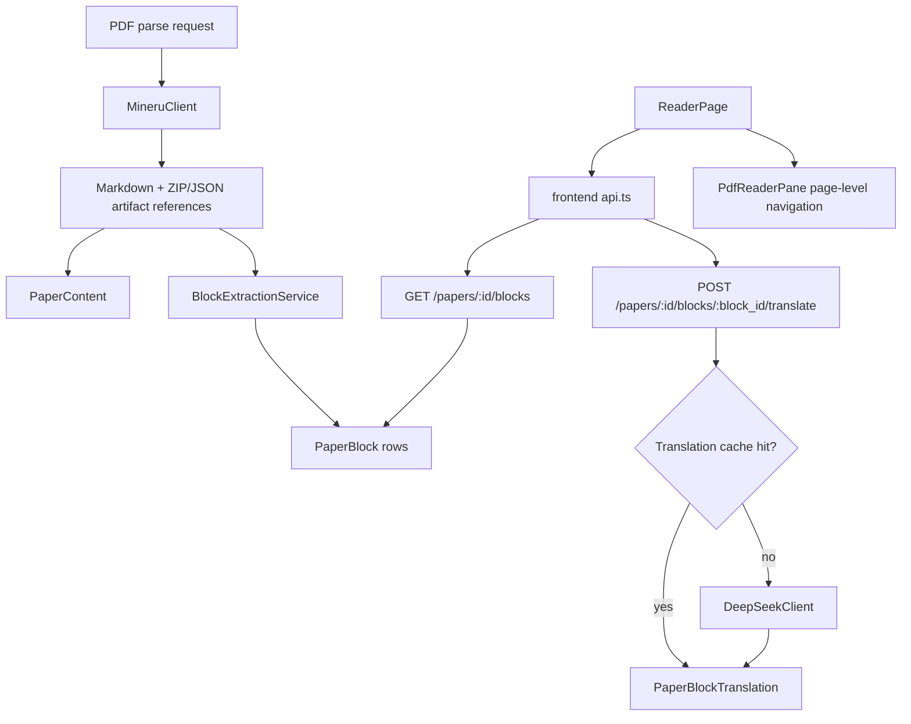

# Design Document

## Overview

`paperquay-blocks-translation` adds PRD Phase 3 to the completed PaperQuay-inspired library: structured MinerU blocks, reader-side block browsing, page-level PDF linkage, and explicit cached block translation.

The design keeps the current web stack:

- Backend: FastAPI, SQLModel, SQLite, existing auth, existing task queue.
- Frontend: React 18, Vite, React Router, existing `components/library` and `components/reader`.
- Parser: existing `MineruClient` and `PaperPipelineService.parse_paper`.
- Model calls: existing OpenAI-compatible `DeepSeekClient` streaming chat path.

Phase 3 does not add Agent operations or Zotero import. It stores provenance that Phase 4 can later reuse.

## Steering Document Alignment

### Technical Standards

No steering documents exist in `.spec-workflow/steering`, so this design follows the repository conventions visible in existing code:

- SQLModel table classes under `backend/app/models`.
- FastAPI route modules under `backend/app/api/routes`.
- Service-level business logic under `backend/app/services`.
- Frontend API wrappers in `frontend/src/lib/api.ts`.
- Focused React components under `frontend/src/components/*`.
- Route-level integration coverage in `frontend/src/App.test.tsx`.

### Project Structure

New code is intentionally modular because `backend/app/api/routes/papers.py` is already large. Block and translation APIs will be placed in a new route module and included from the app route registration. Pure parsing/normalization is isolated so fixture tests can cover MinerU output shapes without invoking the real API.

## Code Reuse Analysis

### Existing Components to Leverage

- **`PaperContent`**: stores `full_markdown`, `content_json_path`, and `full_zip_path`; Phase 3 uses these parse artifacts as the source for block rebuilds.
- **`PaperPipelineService.parse_paper`**: after successful Markdown persistence, it will call block extraction. Block failure will be recoverable and will not turn a successful parse into `parse_failed`.
- **`MineruClient`**: remains responsible for remote MinerU task submission/download. It may be extended to expose structured archive extraction helpers, but it will not store database records.
- **`DeepSeekClient`**: reused for OpenAI-compatible translation calls through a dedicated block-translation method.
- **`ReaderPage` / `ReaderShell`**: existing reader route remains the entry point; Phase 3 adds block data loading and a block workspace surface.
- **`PdfReaderPane`**: continues to render the authenticated PDF blob. Initial block linkage is page-level, because precise bbox overlay is not reliable with the current iframe-based viewer.
- **`frontend/src/lib/api.ts`**: all new frontend calls go through typed API wrappers.

### Integration Points

- **Parse pipeline**: parse PDF -> store markdown/parse artifact paths -> extract and store blocks -> keep existing summary/embedding invalidation behavior.
- **Reader route**: `/paper/:paperId/reader` loads paper detail plus block summary/list on demand.
- **Translation cache**: user action -> frontend calls translation endpoint -> backend checks cache by source hash/language/model/prompt version -> returns cached or newly generated translation.
- **Database migration**: new tables are created by SQLModel metadata. Additive columns are not needed for existing tables in the baseline design.

## Architecture



### Modular Design Principles

- **Model separation**: `PaperBlock` and `PaperBlockTranslation` are separate from `PaperContent` so repeated block records and translations do not inflate one row.
- **Pure normalization**: MinerU output parsing and block normalization are pure functions/classes with fixture coverage.
- **Route separation**: block APIs live in `paper_blocks.py`, not in the existing monolithic paper route.
- **Reader composition**: new block UI is added as reader components and receives data/handlers via props.
- **Cache correctness**: translation cache keys include block source hash, target language, model name, and prompt version.

## Components and Interfaces

### Backend Model: `PaperBlock`

- **Purpose:** Persist normalized structured blocks from MinerU output.
- **Location:** `backend/app/models/paper_block.py`
- **Fields:** paper id, page index, reading order, block type, text, bbox, source JSON, source hash, timestamps.
- **Dependencies:** `Paper` foreign key.
- **Reuses:** SQLModel model style from `PaperContent` and `PaperSummary`.

### Backend Model: `PaperBlockTranslation`

- **Purpose:** Persist cached translations for a block source hash/language/model/prompt version.
- **Location:** `backend/app/models/paper_block_translation.py`
- **Fields:** block id, paper id, target language, model name, prompt version, source hash, translated text, status, error message, timestamps.
- **Dependencies:** `PaperBlock` foreign key and `Paper`.
- **Reuses:** SQLModel table style and timestamp patterns from existing models.

### Backend Service: `BlockExtractionService`

- **Purpose:** Load MinerU structured artifacts and convert them into normalized `PaperBlock` rows.
- **Location:** `backend/app/services/block_extraction_service.py`
- **Interfaces:**
  - `extract_from_parse_result(result: dict[str, str]) -> list[BlockCandidate]`
  - `rebuild_blocks(session: Session, paper: Paper, content: PaperContent) -> BlockRebuildResult`
  - `replace_blocks(session: Session, paper_id: int, candidates: list[BlockCandidate]) -> int`
- **Dependencies:** `PaperContent`, local HTTP/file reads when structured artifacts are URLs, `zipfile`, JSON parser.
- **Reuses:** `MineruClient` artifact paths and existing storage-root safety conventions.

### Backend Service: `BlockTranslationService`

- **Purpose:** Translate a single block with cache lookup and model fallback behavior.
- **Location:** `backend/app/services/block_translation_service.py`
- **Interfaces:**
  - `translate_block(session, paper, block, target_language, model, force_refresh=False) -> PaperBlockTranslation`
  - `find_cached_translation(session, block, target_language, model) -> PaperBlockTranslation | None`
- **Dependencies:** `DeepSeekClient`, `PaperBlock`, `PaperBlockTranslation`.
- **Reuses:** OpenAI-compatible chat endpoint resolution and streaming behavior from `DeepSeekClient`.

### Backend API: `paper_blocks.py`

- **Purpose:** Expose block retrieval, rebuild, and translation endpoints.
- **Location:** `backend/app/api/routes/paper_blocks.py`
- **Interfaces:**
  - `GET /papers/{paper_id}/blocks?page=&type=&q=`
  - `POST /papers/{paper_id}/blocks/rebuild`
  - `POST /papers/{paper_id}/blocks/{block_id}/translate`
- **Dependencies:** auth dependency used by current paper routes, DB session, block services.
- **Reuses:** response-schema patterns from `papers.py`.

### Frontend API Wrappers

- **Purpose:** Keep all fetch logic out of components.
- **Location:** `frontend/src/lib/api.ts`
- **Interfaces:**
  - `fetchPaperBlocks(paperId, filters?)`
  - `rebuildPaperBlocks(paperId)`
  - `translatePaperBlock(paperId, blockId, payload)`
- **Dependencies:** existing `readJson`, `getAuthHeaders`.

### Frontend Reader Components

- **`ReaderBlocksPanel.tsx`**
  - Shows page/type/search filters, block count summary, no-block state, and block list.
- **`ReaderBlockCard.tsx`**
  - Renders one block safely by type, with page action and translation status.
- **`ReaderBlockTranslation.tsx`**
  - Renders cached/loading/error/stale translation states and retry controls.
- **`readerBlockTypes.ts` / `readerBlockUtils.ts`**
  - Type guards, display labels, bbox/page helpers, and safe truncation.

### Reader Route Integration

- `ReaderPage` will fetch blocks after paper detail loads.
- `ReaderShell` receives `blocks`, block loading/error states, filter state, translate/rebuild handlers, and PDF page navigation handler.
- Initial PDF linkage changes mode to PDF and appends `#page=N` to the blob URL when possible. Precise bbox overlay is deferred.

## Data Models

### `PaperBlock`

```python
class PaperBlock(SQLModel, table=True):
    id: int | None = Field(default=None, primary_key=True)
    paper_id: int = Field(index=True, foreign_key="paper.id")
    page_index: int | None = Field(default=None, index=True)
    block_index: int = Field(default=0, index=True)
    block_type: str = Field(default="unknown", index=True)
    text: str = ""
    bbox_json: str = ""          # [x0, y0, x1, y1] in MinerU 0-1000 coordinates when available
    source_hash: str = Field(index=True)
    source_json: str = ""        # bounded JSON string for provenance/debugging
    created_at: datetime = Field(default_factory=lambda: datetime.now(timezone.utc))
    updated_at: datetime = Field(default_factory=lambda: datetime.now(timezone.utc))
```

Indexes:

- `(paper_id, block_index)` for ordered retrieval.
- `(paper_id, page_index)` for page filtering.
- `(paper_id, block_type)` for type filtering.
- `source_hash` for translation cache linkage.

### `PaperBlockTranslation`

```python
class PaperBlockTranslation(SQLModel, table=True):
    id: int | None = Field(default=None, primary_key=True)
    paper_id: int = Field(index=True, foreign_key="paper.id")
    block_id: int = Field(index=True, foreign_key="paperblock.id")
    target_language: str = Field(default="zh-CN", index=True)
    model_name: str = Field(default="gpt-5.4", index=True)
    prompt_version: str = Field(default="block-translate-v1", index=True)
    source_hash: str = Field(index=True)
    translated_text: str = ""
    status: str = Field(default="completed", index=True)  # completed, failed
    error_message: str = ""
    created_at: datetime = Field(default_factory=lambda: datetime.now(timezone.utc))
    updated_at: datetime = Field(default_factory=lambda: datetime.now(timezone.utc))
```

Cache uniqueness is enforced in service logic for `(block_id, target_language, model_name, prompt_version, source_hash, status='completed')` because SQLite partial unique indexes are not currently managed through the project's migration layer.

### `BlockCandidate`

```python
class BlockCandidate(BaseModel):
    page_index: int | None
    block_index: int
    block_type: str
    text: str
    bbox: list[float] | None
    source: dict[str, Any]
    source_hash: str
```

### API Response Types

```python
class PaperBlockResponse(BaseModel):
    id: int
    paper_id: int
    page_index: int | None
    block_index: int
    block_type: str
    text: str
    bbox: list[float] | None
    source_hash: str
    translation: PaperBlockTranslationResponse | None

class PaperBlocksResponse(BaseModel):
    paper_id: int
    total: int
    returned: int
    pages: list[int]
    block_types: dict[str, int]
    has_blocks: bool
    blocks: list[PaperBlockResponse]
```

## Backend Flow

### Parse Flow

1. `PaperPipelineService.parse_paper` calls `MineruClient.parse_pdf`.
2. Existing markdown and artifact paths are written to `PaperContent`.
3. `BlockExtractionService.extract_from_parse_result` attempts to load structured output:
   - Prefer local ZIP entries that contain content/model/result JSON.
   - Fall back to `content_json_path` if it is an HTTP(S) URL.
   - If neither exists, return zero candidates with a no-blocks reason.
4. `replace_blocks` deletes old blocks/translations for the paper and inserts new blocks.
5. Any block extraction exception is logged as a warning and does not change `paper.parse_status` if markdown parsing succeeded.

### Rebuild Flow

1. `POST /papers/{paper_id}/blocks/rebuild` checks paper and `PaperContent`.
2. If no artifact exists, return HTTP 409 with a reparse-required message.
3. Re-run extraction and replacement.
4. Return block summary.

### Translation Flow

1. Validate paper exists and block belongs to paper.
2. Reject empty/non-translatable text.
3. Resolve target language and model defaults.
4. If `force_refresh=false`, return existing successful cache match.
5. Build prompt from block text and a small amount of safe section/page context.
6. Call `DeepSeekClient` through `BlockTranslationService`.
7. Store success. On failure, store or return a failed status while preserving the previous successful translation.

## Frontend Flow

1. `ReaderPage` loads paper detail as it does today.
2. `ReaderPage` calls `fetchPaperBlocks(paper.id)` and stores block state separately from paper detail.
3. `ReaderShell` adds a `Blocks` mode/section alongside Markdown/PDF controls.
4. `ReaderBlocksPanel` filters locally for already-returned data or passes filters to API for larger result sets.
5. Selecting a block highlights the card and exposes:
   - page-level PDF action,
   - translate action,
   - cached/stale/failed translation state.
6. Translate action calls `translatePaperBlock` and updates the matching block's translation in local state.

## Error Handling

1. **No structured artifact**
   - **Handling:** Return zero blocks with `has_blocks=false`; rebuild returns 409 if no artifact exists.
   - **User Impact:** Reader shows "No structured blocks yet" and keeps Markdown/PDF usable.

2. **Malformed MinerU JSON**
   - **Handling:** Extract valid blocks where possible; log malformed entries without full content; return warning in rebuild response.
   - **User Impact:** Reader shows available blocks plus a recoverable warning.

3. **Translation model failure**
   - **Handling:** Preserve original block text and any previous successful translation; show failed status with retry.
   - **User Impact:** User can continue reading and retry translation later.

4. **Stale translation after re-parse**
   - **Handling:** Source hash mismatch prevents stale cache reuse.
   - **User Impact:** UI labels stale/absent translation and offers refresh.

5. **PDF page navigation unsupported**
   - **Handling:** Switch to PDF mode and include page hint when possible; no bbox overlay attempt in Phase 3.
   - **User Impact:** User reaches the relevant page-level context without precise region highlighting.

6. **Auth failure**
   - **Handling:** Existing `readJson` unauthorized reporting path applies.
   - **User Impact:** User returns to auth flow consistently with other paper APIs.

## Testing Strategy

### Unit Testing

- `block_extraction_service` fixture tests:
  - text/title/table/image/formula/list/code/unknown block normalization.
  - bbox normalization and invalid bbox handling.
  - source hash stability.
  - malformed entry recovery.
- `block_translation_service` tests:
  - cache hit avoids model call.
  - source hash mismatch bypasses stale cache.
  - empty block text rejects translation.
  - failure preserves previous completed translation.
- `readerBlockUtils.test.ts`:
  - type labels, page labels, truncation, translation state helpers.

### Backend Integration Testing

- DB migration tests prove new tables are created on existing databases.
- Route tests cover:
  - `GET /papers/{id}/blocks` success, empty state, 404, filters.
  - `POST /papers/{id}/blocks/rebuild` success and 409 no-artifact.
  - `POST /papers/{id}/blocks/{block_id}/translate` cache hit, forced refresh, 404/validation errors.
- Pipeline tests prove parse success is not turned into parse failure when block extraction fails.

### Frontend Integration Testing

- API wrapper tests cover request methods, URLs, auth headers, payloads, and response types.
- Reader component tests cover no-blocks, loading, filtering, block selection, page action, translate success, cached translation, failure retry, and stale label.
- `App.test.tsx` route-level coverage proves existing reader Markdown/PDF behavior still works with block UI mounted.

### Smoke Testing

- Parse one paper from fixture output.
- Open `/paper/:id/reader`.
- View blocks by page/type.
- Use page-level PDF action.
- Translate one text block.
- Reload reader and confirm cached translation appears without another model call in mocked tests.

## Implementation Order

1. Backend models and migration tests.
2. Block normalization service with fixtures.
3. Block persistence integration in parse/rebuild flow.
4. Block API routes and schemas.
5. Translation cache model/service/API.
6. Frontend types/API wrappers.
7. Reader block components.
8. Reader route integration and final verification.

## Phase 4 Boundary

The following are explicitly not implemented in this spec:

- Agent tool execution, approval, rollback, or audit UI.
- Zotero import, `zotero.sqlite` reading, collection/tag mapping.
- Full PDF.js region overlay or annotation editing.
- Full-paper automatic translation.
- Exporting translated blocks.

Phase 4 will start with its own requirements once Phase 3 is complete.

## Sources

- PaperQuay PRD: `.spec-workflow/specs/paperquay-integration/prd.md`
- PaperQuay technical draft: `.spec-workflow/specs/paperquay-integration/technical-spec-draft.md`
- MinerU output format documentation: https://opendatalab.github.io/MinerU/reference/output_files/
- Zotero direct SQLite access documentation: https://www.zotero.org/support/dev/client_coding/direct_sqlite_database_access
