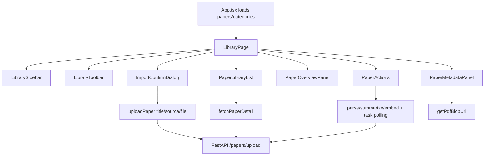

# Design Document

## Overview

本设计把当前 `PaperManagementPage` 渐进替换为 PaperQuay-inspired 文献库工作区。第一阶段只做可安全落地的 Web/FastAPI 适配：重组前端论文管理体验、加入导入确认、保留现有 `/papers` API、保留现有分类/标签/解析/摘要/embedding/PDF 阅读链路。

本设计不复制 PaperQuay 源码。PaperQuay 只作为公开产品能力与交互参考；任何源码级移植都必须另行完成 AGPL-3.0-only 合规确认。

第一阶段目标不是完成 PaperQuay 全功能，而是把旧“论文管理”变成可扩展的文库壳层，后续 Reader、MinerU block、翻译、Agent、Zotero 再按独立任务进入。

## Steering Document Alignment

### Technical Standards

项目当前没有 `.spec-workflow/steering/tech.md`。本设计遵循仓库现有技术约束：

- 前端继续使用 React 18、React Router、Vite、TypeScript。
- 后端继续使用 FastAPI、SQLModel、SQLite。
- 前端 API 统一经过 `frontend/src/lib/api.ts`，不在组件里散落 raw fetch。
- 后端第一阶段不扩大 `backend/app/api/routes/papers.py` 的职责，除非任务明确需要。
- 不引入 Tauri/Rust，不引入大状态库，不引入新 PDF 引擎。

### Project Structure

项目当前没有 `.spec-workflow/steering/structure.md`。本设计采用“先在现有 `components/` 下切分小组件，再评估是否迁移到 `features/`”的方式，避免一次性目录重构。

第一阶段新增前端目录：

```text
frontend/src/components/library/
  LibraryPage.tsx
  LibrarySidebar.tsx
  LibraryToolbar.tsx
  PaperLibraryList.tsx
  PaperMetadataPanel.tsx
  PaperOverviewPanel.tsx
  ImportConfirmDialog.tsx
  libraryFilters.ts
  libraryTypes.ts
```

保留并复用：

```text
frontend/src/components/PaperActions.tsx
frontend/src/components/PaperDetail.tsx
frontend/src/components/FeedbackBanner.tsx
frontend/src/components/StatusBadge.tsx
frontend/src/components/UiIcon.tsx
frontend/src/lib/api.ts
frontend/src/types.ts
```

## Code Reuse Analysis

### Existing Components to Leverage

- **`App.tsx`**: 保留全局 shell、认证后加载 `papers/categories`、`/` 与 `/paper/:paperId` 路由。只把渲染目标从 `PaperManagementPage` 切到新的 `LibraryPage`。
- **`PaperManagementPage.tsx`**: 作为迁移参考，逐步把状态和 handler 拆入 `LibraryPage` 与子组件；旧文件在第一阶段完成后变成兼容导出或删除候选。
- **`PaperList.tsx`**: 复用搜索/标签过滤思路，但新建 `PaperLibraryList`，让列表更适合文库扫描。
- **`PaperDetail.tsx`**: 复用 PDF blob 加载、Markdown 渲染、标签编辑和分类选择能力；第一阶段由 `PaperMetadataPanel`/`PaperOverviewPanel` 分担信息结构，避免继续扩大单文件。
- **`PaperActions.tsx`**: 继续承载 parse/summarize/embed/refresh 操作，位置移动到详情操作栏。
- **`ImportForm.tsx`**: 作为上传交互参考；第一阶段由 `ImportConfirmDialog` 替代旧 modal 内容。
- **`FeedbackBanner.tsx`**: 继续统一展示成功/错误反馈。
- **`StatusBadge.tsx`**: 继续展示 paper、parse、summary、embedding 状态。
- **`UiIcon.tsx`**: 所有新增按钮继续使用项目图标系统。

### Existing Services to Leverage

- **`fetchPapers` / `fetchCategories`**: 仍由 `App.tsx` 加载全局文库数据。
- **`fetchPaperDetail`**: 选中论文后加载详情。
- **`uploadPaper`**: 扩展 payload，支持可选 `title`，并追加到 `FormData`。后端 `upload_paper` 已支持 `title: str = Form("")`。
- **`parsePaper` / `summarizePaper` / `embedPaper` / `waitForTaskCompletion`**: 继续用于任务操作。
- **`updatePaperCategory` / `updatePaperTags`**: 继续用于分类和标签。
- **`getPdfBlobUrl`**: 继续由 reader/detail 组件加载 PDF。
- **`StorageService.import_uploaded_pdf`**: 继续作为文件入库路径。
- **`initialize_pending_category` / `update_paper_category`**: 继续作为分类写入边界。
- **`_recover_stale_pipeline_state`**: 继续恢复 stale task 状态。

### Integration Points

- **Routing**: `/` 与 `/paper/:paperId` 渲染 `LibraryPage`；其他模块通过 `navigate('/paper/:id')` 打开文库详情。
- **Backend APIs**: 第一阶段不新增后端 route。只扩展前端 `uploadPaper` 的参数以使用现有后端 title form 字段。
- **Database**: 第一阶段不新增表、不做 schema migration。现有 `Paper` 已有 `authors`、`abstract_raw`、`pdf_url`、`published_at`、`primary_category_id`、`tags_json`，但当前 `PaperResponse` 未暴露全部字段；第一阶段先在 UI 中显示已可用字段，缺失字段标记为后续元数据扩展。
- **CSS**: 新增 `.library-*` 样式段落到 `frontend/src/index.css`，复用当前暗色/浅色变量和按钮体系。
- **Tests**: 复用 `frontend/src/App.test.tsx` 的 routing/mock 基础，新增文库行为断言。

## Architecture

第一阶段采用前端主导的壳层重组。后端保持现有 contract，降低迁移风险。



### Modular Design Principles

- **Single File Responsibility**: `LibraryPage` 只编排状态和数据流；视觉和交互拆到子组件。
- **Component Isolation**: 分类栏、工具栏、列表、详情、概览、导入确认各自独立。
- **Service Layer Separation**: 组件不直接拼接 API URL；所有请求通过 `lib/api.ts`。
- **Utility Modularity**: 搜索/筛选/统计放入 `libraryFilters.ts`，避免嵌入 JSX 文件。

## Components and Interfaces

### `LibraryPage`

- **Purpose:** 新论文管理入口，编排分类筛选、论文选择、详情加载、任务操作、导入确认和反馈。
- **Interfaces:**

```ts
type LibraryPageProps = {
  papers: Paper[]
  categories: Category[]
  isLoadingLibrary: boolean
  refreshLibrary: () => Promise<void>
}
```

- **Dependencies:** `useParams`, `useNavigate`, existing API functions, `LibrarySidebar`, `LibraryToolbar`, `PaperLibraryList`, `PaperMetadataPanel`, `PaperOverviewPanel`, `PaperActions`, `ImportConfirmDialog`, `FeedbackBanner`.
- **Reuses:** Most state handlers currently in `PaperManagementPage`.

### `LibrarySidebar`

- **Purpose:** 显示全部论文、系统分类、自定义分类、待确认分类，支持范围选择和分类选中。
- **Interfaces:**

```ts
type LibrarySidebarProps = {
  papers: Paper[]
  categories: Category[]
  selectedCategoryId: number | null
  categoryScope: CategoryScope
  onCategoryScopeChange: (scope: CategoryScope) => void
  onSelectCategory: (categoryId: number | null) => void
}
```

- **Dependencies:** `Category`, `Paper`, `CategoryScope`.
- **Reuses:** Existing `filterCategoriesByScope` behavior, moved to `libraryFilters.ts`.

### `LibraryToolbar`

- **Purpose:** 顶部文库动作区，提供导入、刷新、新建分类入口、搜索状态摘要、失败解析批量操作。
- **Interfaces:**

```ts
type LibraryToolbarProps = {
  isLoadingLibrary: boolean
  totalPapers: number
  pendingCount: number
  parseFailedCount: number
  isRetryingParseFailed: boolean
  isDeletingParseFailed: boolean
  onOpenImport: () => void
  onToggleCreateCategory: () => void
  onRetryParseFailed: () => Promise<void>
  onDeleteParseFailed: () => Promise<void>
}
```

- **Dependencies:** Buttons, status text.
- **Reuses:** Bulk parse failure handlers from `PaperManagementPage`.

### `PaperLibraryList`

- **Purpose:** 密集型论文列表，支持搜索、标签筛选、状态筛选、选中、删除。
- **Interfaces:**

```ts
type PaperLibraryListProps = {
  papers: Paper[]
  selectedPaperId: number | null
  isLoading: boolean
  searchQuery: string
  statusFilter: string
  activeTag: string | null
  onSearchChange: (query: string) => void
  onStatusFilterChange: (status: string) => void
  onTagChange: (tag: string | null) => void
  onSelect: (paper: Paper) => void
  onDelete: (paper: Paper) => Promise<void>
}
```

- **Dependencies:** `StatusBadge`, `Icon`.
- **Reuses:** Existing list skeleton and delete confirmation behavior.

### `PaperMetadataPanel`

- **Purpose:** 显示选中论文的标题、来源、状态、主分类、标签、文件状态和快捷 reader 入口。
- **Interfaces:**

```ts
type PaperMetadataPanelProps = {
  paper: PaperDetail | null
  categories: Category[]
  isLoading: boolean
  isUpdatingCategory: boolean
  onCategoryChange: (categoryId: number) => Promise<void>
}
```

- **Dependencies:** `StatusBadge`, `updatePaperTags`, `getPdfBlobUrl` through child reader action.
- **Reuses:** Current `PaperDetail` title/status/category/tag logic.

### `PaperOverviewPanel`

- **Purpose:** 把现有 `PaperSummary` 字段映射为 PaperQuay-style 论文概览。
- **Interfaces:**

```ts
type PaperOverviewPanelProps = {
  paper: PaperDetail | null
}
```

- **Mapping:**
  - `one_line_summary` -> 快速结论
  - `core_contributions` -> 核心贡献
  - `method_summary` -> 方法概览
  - `use_cases` -> 适用场景
  - `limitations` -> 局限
  - `relevance_note` -> 与研究方向相关性

- **Reuses:** `SummaryCard` content, but layout becomes overview sections rather than a monolithic detail block.

### `ImportConfirmDialog`

- **Purpose:** 替代旧导入 modal。先选文件并确认标题/来源，再提交上传。
- **Interfaces:**

```ts
type ImportConfirmDialogProps = {
  isSubmitting: boolean
  existingPapers: Paper[]
  onSubmit: (payload: { source: string; title: string; file: File }) => Promise<boolean>
  onClose: () => void
}
```

- **Behavior:**
  - 只接受 PDF。
  - 标题默认从文件名推断，用户可编辑。
  - 使用当前文库 `existingPapers` 做客户端重复提醒，匹配规则为标题忽略大小写完全相同。
  - 成功后关闭弹窗并导航到新论文。

- **Reuses:** Drag/drop and validation behavior from `ImportForm`.

### `libraryFilters.ts`

- **Purpose:** 纯函数集合，支持分类范围、搜索、状态、标签、统计。
- **Interfaces:**

```ts
function filterCategoriesByScope(categories: Category[], scope: CategoryScope): Category[]
function collectTags(papers: Paper[]): string[]
function filterPapers(input: {
  papers: Paper[]
  selectedCategoryId: number | null
  searchQuery: string
  statusFilter: string
  activeTag: string | null
}): Paper[]
function countPendingPapers(papers: Paper[]): number
function findDuplicateByTitle(papers: Paper[], title: string): Paper | null
```

- **Dependencies:** `Paper`, `Category`, `CategoryScope`.
- **Reuses:** Current filtering logic from `PaperManagementPage` and `PaperList`.

## Data Models

### Existing `Paper`

第一阶段继续使用现有前端类型：

```ts
type Paper = {
  id: number
  title: string
  source: string
  status: string
  parse_status: string
  summary_status: string
  embedding_status: string
  local_pdf_path: string
  updated_at?: string
  primary_category_id?: number | null
  category_status?: string
  category_confidence?: number
  category_reason?: string
  tags?: string[]
}
```

### Existing `PaperDetail`

第一阶段继续使用现有详情类型：

```ts
type PaperDetail = Paper & {
  full_markdown: string
  abstract_md: string
  introduction_md: string
  method_md: string
  conclusion_md: string
  one_line_summary: string
  core_contributions: string
  method_summary: string
  use_cases: string
  limitations: string
  relevance_note: string
}
```

### `ImportConfirmPayload`

新增前端 payload，不需要后端 schema 变更：

```ts
type ImportConfirmPayload = {
  source: string
  title: string
  file: File
}
```

`uploadPaper` 更新为：

```ts
export async function uploadPaper(payload: {
  source: string
  title?: string
  file: File
}): Promise<Paper>
```

`title` 通过 `FormData.append('title', payload.title)` 传给现有 `/papers/upload`。

### Deferred Metadata Fields

以下字段在第一阶段只在设计中预留，不落库：

```ts
type DeferredPaperMetadata = {
  year?: number
  venue?: string
  doi?: string
  url?: string
  favorite?: boolean
  reading_status?: 'unread' | 'reading' | 'read' | 'skipped'
  reading_progress?: number
  user_notes?: string
}
```

这些字段必须在后续 schema migration 任务中进入 `PaperResponse`/`PaperDetailResponse` 后才能在 UI 中变成可编辑数据。

## Error Handling

### Error Scenarios

1. **PDF 文件无效或未选择**
   - **Handling:** `ImportConfirmDialog` 在提交前检查文件扩展名和存在性。
   - **User Impact:** 弹窗内显示错误，不发请求。

2. **导入标题疑似重复**
   - **Handling:** 客户端使用 `findDuplicateByTitle` 展示重复提醒；用户仍可继续导入。
   - **User Impact:** 避免无意重复，保留人工决策。

3. **上传 API 失败**
   - **Handling:** `uploadPaper` 抛错，`LibraryPage` 设置 `errorMessage`，弹窗保持打开。
   - **User Impact:** 用户可修改信息后重试。

4. **选中论文详情加载失败**
   - **Handling:** 保持列表可用，详情区展示错误反馈和空状态。
   - **User Impact:** 文库不崩溃，可选择其他论文或刷新。

5. **解析/摘要/embedding 任务重复提交**
   - **Handling:** 复用后端 409/400 错误和前端 running 状态禁用按钮。
   - **User Impact:** 防止重复任务，展示明确错误。

6. **PDF 文件缺失或无法加载**
   - **Handling:** `getPdfBlobUrl` 失败后展示 PDF 加载错误，不影响 Markdown/概览。
   - **User Impact:** 用户仍可查看元数据和已解析内容。

7. **分类更新后当前筛选不可见**
   - **Handling:** 复用现有逻辑，若论文移出当前分类则清空选中并回到 `/`。
   - **User Impact:** 视觉状态与筛选结果一致。

8. **AGPL/source reuse 未批准**
   - **Handling:** tasks 不允许包含复制 PaperQuay 源码步骤。
   - **User Impact:** 第一阶段只交付概念适配，不引入许可风险。

## Testing Strategy

### Unit Testing

- `libraryFilters.ts`
  - `filterCategoriesByScope` 按 all/system/custom/pending 返回正确分类。
  - `collectTags` 去重并排序。
  - `filterPapers` 同时处理分类、搜索、状态、标签。
  - `findDuplicateByTitle` 忽略大小写和前后空格匹配。

### Integration Testing

- `frontend/src/App.test.tsx`
  - `/` 渲染 PaperQuay-inspired 文库工作区。
  - 点击列表论文进入 `/paper/:paperId` 并加载详情。
  - 导入弹窗先显示标题/来源确认，再调用 `uploadPaper`。
  - 重复标题显示提醒。
  - parse/summarize/embed 操作仍调用现有 API mock 并刷新文库。
  - daily briefing 或 recommendation 中 `navigate('/paper/:id')` 仍打开新文库详情。

- Backend targeted tests
  - 当前 `/papers/upload` 支持 title form override 的行为应被显式测试。
  - 现有 paper route tests 继续通过。

### End-to-End / Smoke Testing

手动或脚本 smoke：

1. 启动后端和前端。
2. 打开 `/`，看到文库三栏工作区。
3. 导入一个 sample PDF，确认标题后提交。
4. 自动导航到 `/paper/:id`。
5. 触发 parse、summarize、embed。
6. 切换 PDF/Markdown 阅读。
7. 从 `/briefing` 或 `/recommendation` 打开同一论文。

## Implementation Phasing

### Phase 1A: Frontend Library Shell

- 新增 `components/library` 组件。
- `App.tsx` 路由切换到 `LibraryPage`。
- 迁移 `PaperManagementPage` 中的状态和 handlers。
- 不改后端。

### Phase 1B: Import Confirmation

- 新增 `ImportConfirmDialog`。
- 更新 `uploadPaper` 支持 `title`。
- 后端补测试验证现有 `/papers/upload` title override。

### Phase 1C: Detail/Overview Restructure

- 拆分元数据、概览、操作区。
- 复用 `PaperDetail` 的 PDF/Markdown 能力，避免一次性重写 reader。

### Phase 1D: Verification and Cleanup

- 补前端测试。
- 保留 `PaperManagementPage` 作为兼容导出或删除，取决于任务执行时引用情况。
- 运行 targeted frontend/backend tests。

## Deferred Phases

- **Reader Shell:** 独立 `components/reader`，再处理 PDF/Markdown 分栏、阅读位置、章节导航。
- **MinerU Blocks:** 新增后端 block model 和 route，持久化页码/bbox/text/type/order。
- **Translation Cache:** 新增 translation model/service，支持 selection/block translation。
- **Agent Workspace:** 扩展 chat tool execution trace、人工确认和审计。
- **Zotero Import:** 新增只读导入 service，复制 `zotero.sqlite` 后解析。

## Risk Controls

- 第一阶段不做数据库迁移，降低历史数据风险。
- 第一阶段不直接使用 PaperQuay 源码，规避 AGPL 风险。
- 第一阶段不拆后端 `papers.py`，避免一次性破坏 API；后续后端重构单独计划。
- 新 UI 使用现有 API wrapper，避免绕过鉴权和 unauthorized 事件。
- 每个阶段都保留旧核心能力：导入、选中、详情、解析、摘要、embedding、删除。

