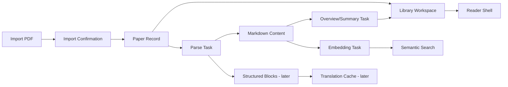

# Technical Spec Draft: PaperQuay-Inspired Library Integration

> Status: draft only. This is not an implementation plan. It must be revised after `requirements-questionnaire.md` is filled and `requirements.md` is approved.

## Overview

The integration will replace the current `PaperManagementPage` experience with a PaperQuay-inspired literature library while preserving the existing Web stack:

- Frontend: React 18 + Vite + React Router
- Backend: FastAPI + SQLModel + SQLite
- Existing paper pipeline: upload/import, MinerU parse, summarize, embed, PDF route

PaperQuay's architecture is Tauri 2 + React + Rust commands + SQLite. The first integration phase should not adopt Tauri/Rust. Instead, it should translate PaperQuay's product concepts into the current stack.

## Source Reference

PaperQuay public repository describes these relevant modules:

- `src/features/literature/`: local literature library UI, import workflow, category tree, paper details
- `src/features/reader/`: reader shell, linked reading workspace, settings, AI reading actions
- `src/features/pdf/`: PDF rendering and annotation surface
- `src/features/blocks/`: MinerU block rendering and structured content views
- `src/features/agent/`: Agent chat UI, execution traces, tool cards, library operations
- `src-tauri/src/commands/`: file, SQLite, Zotero, MinerU, metadata, translation, overview, QA, Agent commands

## Recommended Integration Strategy

### Strategy A: Adapt Concepts, Preserve Stack

Use PaperQuay as product and interaction reference. Rebuild the necessary UI and backend services in this project.

Pros:
- Lowest license and architecture risk.
- Preserves current backend, auth, subscriptions, daily briefing, and recommendation integrations.
- Allows staged delivery.

Cons:
- More implementation work than embedding an external app.
- Some PaperQuay behavior must be re-designed for browser constraints.

Recommendation: use this strategy.

### Strategy B: Source-Level Port

Copy selected PaperQuay React modules and adapt them to current APIs.

Pros:
- Faster visual parity if APIs align.

Cons:
- AGPL obligations must be handled.
- PaperQuay modules likely depend on Tauri service bridges and local command contracts.
- Higher integration risk.

Use only after explicit license approval.

### Strategy C: Full Desktop Pivot

Move the whole project toward PaperQuay/Tauri and port existing backend features later.

Pros:
- Closest to PaperQuay's original architecture.

Cons:
- Highest rewrite risk.
- Delays existing Web features.
- Requires Rust/Tauri environment and packaging decisions.

Not recommended for the current request.

## Current Code Reuse

### Frontend

- `frontend/src/App.tsx`: keep global navigation and routes; route `/` and `/paper/:paperId` should render the new library experience.
- `frontend/src/components/PaperManagementPage.tsx`: replace or decompose into new library modules.
- `frontend/src/components/PaperList.tsx`: reuse search/list behavior where practical, or replace with a denser library table/list.
- `frontend/src/components/PaperDetail.tsx`: reuse markdown rendering and detail fields, but split overview/reader/metadata responsibilities.
- `frontend/src/components/PaperActions.tsx`: reuse parse/summarize/embed actions with redesigned placement.
- `frontend/src/components/ImportForm.tsx`: evolve into import confirmation flow.
- `frontend/src/lib/api.ts`: keep API wrapper as the single frontend integration boundary.
- `frontend/src/types.ts`: extend after schema decisions are approved.

### Backend

- `backend/app/api/routes/papers.py`: current paper API source. It is large; future changes should avoid adding unrelated concerns here.
- `backend/app/models/paper.py`: current core paper record.
- `backend/app/models/paper_content.py`: parsed markdown content.
- `backend/app/models/paper_summary.py`: current summary fields.
- `backend/app/models/paper_embedding.py`: current embedding storage.
- `backend/app/services/storage.py`: PDF import/storage.
- `backend/app/services/pipeline.py`: parse/summarize/embed orchestration.
- `backend/app/services/mineru_client.py`: MinerU integration.
- `backend/app/services/category_service.py`: category assignment and pending bucket logic.

## Proposed Frontend Modules

Target modules should remain small and testable.

```text
frontend/src/features/library/
  LibraryPage.tsx
  LibrarySidebar.tsx
  LibraryToolbar.tsx
  PaperLibraryList.tsx
  PaperMetadataPanel.tsx
  PaperOverviewPanel.tsx
  ImportConfirmDialog.tsx
  libraryFilters.ts
  libraryTypes.ts

frontend/src/features/reader/
  ReaderShell.tsx
  PdfReaderPane.tsx
  MarkdownReaderPane.tsx
  ReaderToolbar.tsx

frontend/src/features/agent/        # later phase
frontend/src/features/translation/  # later phase
```

If the project prefers the current `components/` layout, the same boundaries can be created under `frontend/src/components/library/`. The key requirement is smaller files with clear ownership.

## Proposed Backend Modules

Only create these when the corresponding phase needs them:

```text
backend/app/api/routes/library.py
backend/app/api/routes/paper_metadata.py
backend/app/api/routes/paper_overviews.py
backend/app/api/routes/paper_blocks.py
backend/app/api/routes/translations.py
backend/app/api/routes/zotero.py

backend/app/models/paper_author.py
backend/app/models/paper_attachment.py
backend/app/models/paper_note.py
backend/app/models/paper_block.py
backend/app/models/paper_translation.py

backend/app/services/library_service.py
backend/app/services/metadata_service.py
backend/app/services/zotero_import_service.py
backend/app/services/translation_service.py
```

Do not add all modules upfront. Create them only when requirements and tasks justify them.

## Data Model Direction

### Phase 1: Minimal Extension

Prefer a minimal extension if P0 answers are still conservative:

- Add optional fields to `papers`: year, venue, doi, url, favorite, reading_status, reading_progress, notes.
- Keep `primary_category_id` and `tags_json` for compatibility.
- Add import confirmation UI without major schema migration.

### Phase 2+: Normalized Library Model

If approved, evolve toward:

- `paper_authors`: normalized authors and order.
- `paper_tags`: normalized many-to-many tags.
- `paper_collections`: multi-membership collections/categories.
- `paper_attachments`: PDF and auxiliary files.
- `paper_notes`: user notes separate from generated summaries.
- `paper_blocks`: MinerU structured blocks with page and bbox metadata.
- `paper_translations`: cached translations linked to paper/block/model.

## Data Flow



## UI/UX Direction

The UI should be a data-dense research workspace, not a landing page. The `ui-ux-pro-max` lookup recommended a data-dense dashboard pattern, accessible React testing, labeled controls, visible focus states, and smooth row/tooltip interactions. Its suggested purple/orange palette should not be adopted directly because project rules discourage one-note purple themes and the current app already has a dark research-workbench visual language.

UI principles:

- Use the current app shell and left navigation.
- Make the literature library the first-screen experience for `/` and `/paper/:paperId`.
- Prefer compact, scannable lists and predictable controls.
- Use icons from the existing icon system or a consistent icon set; no emoji icons.
- Keep cards for repeated items and modals only; avoid nested cards.
- Support 375px, 768px, 1024px, and 1440px layouts.
- Every form control must have a label; tests should prefer accessible queries.

## API Direction

Phase 1 should reuse current API functions:

- `fetchPapers`
- `fetchCategories`
- `fetchPaperDetail`
- `uploadPaper`
- `deletePaper`
- `parsePaper`
- `summarizePaper`
- `embedPaper`
- `updatePaperCategory`
- `updatePaperTags`
- `getPdfBlobUrl`

Add new API functions only after requirements confirm fields and backend routes.

## Error Handling

- Import errors: show per-file error and allow retry.
- Duplicate detection: warn before insertion.
- Missing PDF: show file-missing state and disable reader actions.
- Parse/summarize/embed active task: show task status and prevent duplicate submission.
- Stale task: reuse existing recovery behavior.
- Translation/Agent/Zotero errors: phase-specific structured error reports.
- License uncertainty: block source-level port tasks until approved.

## Testing Strategy

### Frontend

- Library route renders category rail, paper list, detail panel.
- Selecting a paper loads detail and updates route.
- Import confirmation validates required fields.
- Parse/summarize/embed actions call API and update feedback.
- Search/filter controls are labeled and keyboard accessible.
- Daily briefing/recommendation links open the new paper route.

### Backend

- Existing paper route tests continue to pass.
- Migration tests cover any schema changes.
- Import/upload tests cover metadata and storage behavior.
- Parse/summarize/embed tests cover task state compatibility.

### Smoke

- Import one sample PDF.
- Open it in the library.
- Parse it.
- Generate overview/summary.
- Open PDF/Markdown reader.
- Confirm old briefing/recommendation links still navigate.

## Implementation Gates

No implementation should begin until:

1. P0/P1 questionnaire answers are captured.
2. Requirements are approved.
3. This technical spec is updated from draft to approved design.
4. Tasks are split into 1-3 file changes with explicit verification.
5. License strategy is recorded.

