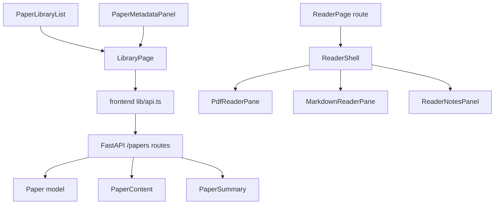

# Design Document

## Overview

This design implements PaperQuay Phase 2 as a focused continuation of the completed library shell. It adds persisted metadata, favorites, reading state/progress, user notes, and a dedicated reader route with PDF and Markdown modes.

The system remains FastAPI + SQLModel + SQLite on the backend and React/Vite on the frontend. The design extends existing paper models and routes instead of creating a parallel library domain. It deliberately defers MinerU structured blocks, translation cache, Agent tools, Zotero import, normalized author tables, multi-category membership, and PDF annotations.

## Steering Document Alignment

### Technical Standards

- Use existing FastAPI route style and SQLModel models.
- Keep SQLite migrations compatible with the current `_migrate_add_columns` helper.
- Keep frontend network access inside `frontend/src/lib/api.ts`.
- Keep reader and metadata UI in focused files under `frontend/src/components/reader/` and `frontend/src/components/library/`.
- Keep existing authentication behavior by extending current `/papers` routes rather than adding unauthenticated surfaces.

### Project Structure

- Backend schema changes stay in `backend/app/models/paper.py`, `backend/app/schemas/paper.py`, and `backend/app/core/db.py`.
- Backend paper route changes stay close to the existing `PATCH /papers/{id}` and `GET /papers/{id}` handlers.
- Frontend shared types stay in `frontend/src/types.ts`.
- Reader components live under `frontend/src/components/reader/`.
- Library integration updates stay under `frontend/src/components/library/`.
- Tests are added beside current test suites: `backend/tests/`, `frontend/src/lib/api.test.ts`, and `frontend/src/App.test.tsx`.

## Code Reuse Analysis

### Existing Components to Leverage

- **`LibraryPage`**: Keeps `/` and `/paper/:paperId` as the library-detail experience and opens the reader through navigation.
- **`PaperMetadataPanel`**: Becomes the primary editable metadata, favorite, reading-state, and notes entry.
- **`PaperLibraryList`**: Adds compact favorite and reading-state indicators plus filters.
- **`PaperOverviewPanel`**: Remains the summary/overview panel and is reused inside the reader side context where needed.
- **`StatusBadge` and `UiIcon`**: Provide compact status and iconography.
- **Existing Markdown rendering from `PaperDetail.tsx`**: Informs the reader Markdown pane, but the new reader should use smaller focused components rather than expanding the old monolith.
- **`getPdfBlobUrl`**: Continues to load authenticated PDFs through `/papers/{id}/pdf`.

### Existing Backend to Leverage

- **`Paper` model**: Receives additive nullable/defaulted fields for Phase 2.
- **`PaperResponse` and `PaperDetailResponse`**: Include Phase 2 fields so list/detail/reader share one contract.
- **`_migrate_add_columns`**: Adds SQLite-safe columns for existing databases.
- **`PATCH /papers/{id}`**: Becomes the typed partial update endpoint for metadata, favorite, reading state, progress, and notes.
- **`GET /papers/{id}`**: Returns content and summary plus Phase 2 paper fields.
- **`GET /papers/{id}/pdf`**: Remains the PDF source for the reader.

## Architecture

Phase 2 uses additive model fields and typed partial updates. The backend remains the source of truth for paper metadata and reading state. The frontend fetches paper detail for both library detail and reader, then submits focused update payloads through API wrapper functions.



### Modular Design Principles

- `LibraryPage` remains an orchestrator and should not absorb reader UI.
- Reader concerns are split into shell, toolbar, PDF pane, Markdown pane, notes panel, and heading utilities.
- Metadata editing is isolated from list filtering.
- Backend validation is centralized in schemas/helper functions rather than duplicated across route branches.
- Each task should modify a small group of files and include tests before or alongside implementation.

## Components and Interfaces

### Backend: `Paper` Phase 2 Fields

- **Purpose:** Store the minimum reader and personal organization fields without introducing new tables.
- **Fields:**
  - `year: Optional[int]`
  - `venue: str`
  - `doi: str`
  - `url: str`
  - `favorite: bool`
  - `reading_status: str`
  - `reading_progress: int`
  - `user_notes: str`
- **Dependencies:** SQLModel, existing migration helper.
- **Reuses:** Current paper row lifecycle and delete behavior.

### Backend: Paper Update Schemas

- **Purpose:** Validate partial updates for metadata, favorite, reading state, progress, and notes.
- **Interface:**

```python
class PaperUpdateRequest(BaseModel):
    title: str | None = None
    source: str | None = None
    authors: str | None = None
    abstract_raw: str | None = None
    year: int | None = None
    venue: str | None = None
    doi: str | None = None
    url: str | None = None
    favorite: bool | None = None
    reading_status: str | None = None
    reading_progress: int | None = None
    user_notes: str | None = None
```

- **Validation:**
  - `title`, when provided, must not be blank.
  - `year`, when provided, must be between 1500 and 3000.
  - `url`, when provided, must be blank or start with `http://` or `https://`.
  - `reading_status` must be one of `unread`, `reading`, `read`, or `skipped`.
  - `reading_progress` must be 0 through 100.
- **Reuses:** Existing `PATCH /papers/{id}` route, replacing query parameters with JSON body support while preserving compatibility for current callers where practical.

### Backend: Response Contracts

- **Purpose:** Include Phase 2 fields in paper list and detail responses.
- **Interfaces:**

```python
class PaperResponse(BaseModel):
    year: int | None = None
    venue: str = ""
    doi: str = ""
    url: str = ""
    authors: str = ""
    abstract_raw: str = ""
    favorite: bool = False
    reading_status: str = "unread"
    reading_progress: int = 0
    user_notes: str = ""
```

- **Dependencies:** `Paper` model and `PaperResponse.extract_tags` validator.
- **Reuses:** Existing list/detail response shapes.

### Frontend: Type and API Updates

- **Purpose:** Make Phase 2 fields typed and force components through `api.ts`.
- **Interfaces:**

```ts
export type ReadingStatus = 'unread' | 'reading' | 'read' | 'skipped'

export type PaperUpdatePayload = {
  title?: string
  source?: string
  authors?: string
  abstract_raw?: string
  year?: number | null
  venue?: string
  doi?: string
  url?: string
  favorite?: boolean
  reading_status?: ReadingStatus
  reading_progress?: number
  user_notes?: string
}
```

- **API wrappers:**
  - `updatePaper(id, payload)` sends `PATCH /papers/{id}` JSON.
  - `updatePaperFavorite(id, favorite)` calls `updatePaper`.
  - `updatePaperReadingState(id, payload)` calls `updatePaper`.
  - `updatePaperNotes(id, user_notes)` calls `updatePaper`.
- **Reuses:** Existing `readJson`, `getAuthHeaders`, and unauthorized handling.

### Frontend: `PaperMetadataPanel`

- **Purpose:** Add editable metadata, favorite, reading state, progress, and notes entry to the existing library detail panel.
- **Interface additions:**
  - `onMetadataSave(payload: PaperUpdatePayload)`
  - `onFavoriteChange(favorite: boolean)`
  - `onReadingStateChange(payload: Pick<PaperUpdatePayload, 'reading_status' | 'reading_progress'>)`
  - `onNotesSave(userNotes: string)`
- **Behavior:**
  - Uses explicit Save for metadata and notes.
  - Keeps unsaved notes visible on failure.
  - Does not display full local PDF path.
  - Keeps category and tags callbacks unchanged.
- **Reuses:** Existing category, tags, status, and reader entry layout.

### Frontend: `PaperLibraryList`

- **Purpose:** Surface compact favorite and reading-state indicators and add filters.
- **Interface additions:**
  - `favoriteFilter: 'all' | 'favorites'`
  - `readingStatusFilter: 'all' | ReadingStatus`
  - `onFavoriteFilterChange`
  - `onReadingStatusFilterChange`
- **Behavior:**
  - Indicators use stable dimensions to avoid row layout shift.
  - Filtering remains deterministic and client-side for Phase 2.
- **Reuses:** Existing `filterPapers` helper extension.

### Frontend: `ReaderShell`

- **Purpose:** Focused reading workspace for one paper.
- **Location:** `frontend/src/components/reader/ReaderShell.tsx`
- **Props:**

```ts
type ReaderShellProps = {
  paper: PaperDetail | null
  isLoading: boolean
  errorMessage: string
  mode: 'markdown' | 'pdf'
  onModeChange: (mode: 'markdown' | 'pdf') => void
  onBackToLibrary: () => void
  onRetryPdf: () => void
  onParse: () => Promise<void>
  onNotesSave: (userNotes: string) => Promise<void>
  onReadingStateChange: (payload: { reading_status?: ReadingStatus; reading_progress?: number }) => Promise<void>
}
```

- **Children:**
  - `ReaderToolbar`
  - `MarkdownReaderPane`
  - `PdfReaderPane`
  - `ReaderNotesPanel`
  - `ReaderMetadataRail`
- **Reuses:** `PaperOverviewPanel`, `StatusBadge`, `UiIcon`, `getPdfBlobUrl`.

### Frontend: Reader Route Orchestrator

- **Purpose:** Load detail for `/paper/:paperId/reader`, own reader mode state, and update reading state.
- **Location:** `frontend/src/components/reader/ReaderPage.tsx`
- **Behavior:**
  - Fetches paper detail by route param.
  - Sets unread papers to `reading` when first opened.
  - Does not overwrite `read` or `skipped`.
  - Revokes PDF blob URLs on paper/mode change.
  - Navigates back to `/paper/:paperId`.
- **Reuses:** Existing `fetchPaperDetail`, update wrappers, and parse action wrapper where needed.

## Data Models

### Backend `Paper`

```python
class Paper(SQLModel, table=True):
    year: Optional[int] = None
    venue: str = ""
    doi: str = ""
    url: str = ""
    favorite: bool = False
    reading_status: str = "unread"
    reading_progress: int = 0
    user_notes: str = ""
```

### Frontend `Paper`

```ts
export type ReadingStatus = 'unread' | 'reading' | 'read' | 'skipped'

export type Paper = {
  year?: number | null
  venue?: string
  doi?: string
  url?: string
  authors?: string
  abstract_raw?: string
  favorite?: boolean
  reading_status?: ReadingStatus
  reading_progress?: number
  user_notes?: string
}
```

### Reader Heading Model

```ts
type ReaderHeading = {
  id: string
  level: number
  title: string
}
```

The heading model is derived from `paper.full_markdown`; it is not persisted in Phase 2.

## API Design

### `PATCH /papers/{paper_id}`

- **Request:** JSON body matching `PaperUpdateRequest`.
- **Response:** `PaperResponse`.
- **Compatibility:** The existing frontend `updatePaper` callers should remain source-compatible after wrapper migration. Backend may continue accepting legacy query params during the transition if implementation cost is low.
- **Validation Errors:** 422 for schema-level validation, 400 for domain validation when needed, 404 for missing paper.

### `GET /papers`

- **Response:** Existing `list[PaperResponse]`, extended with Phase 2 fields.
- **Behavior:** Existing list ordering and filters remain unchanged.

### `GET /papers/{paper_id}`

- **Response:** Existing `PaperDetailResponse`, extended with Phase 2 fields.
- **Behavior:** Existing stale task recovery and content/summary assembly remain unchanged.

## Error Handling

### Error Scenarios

1. **Invalid metadata update**
   - **Handling:** Backend rejects invalid payload; frontend shows field or form error.
   - **User Impact:** Current detail remains visible and unsaved edits stay in the form.

2. **Favorite or reading-state update fails**
   - **Handling:** UI restores previous state or refreshes detail from server.
   - **User Impact:** User sees a recoverable error banner and can retry.

3. **Note save fails**
   - **Handling:** Keep textarea value local and show error.
   - **User Impact:** User does not lose note text.

4. **PDF load fails**
   - **Handling:** `PdfReaderPane` shows error and retry button.
   - **User Impact:** Markdown mode and metadata rail stay usable when available.

5. **Markdown missing**
   - **Handling:** `MarkdownReaderPane` shows parse-needed state and parse action.
   - **User Impact:** User can still switch to PDF or trigger parsing.

6. **Existing database lacks new columns**
   - **Handling:** `_migrate_add_columns` adds defaults at startup; tests cover old database path.
   - **User Impact:** Existing papers load with default Phase 2 values.

## Testing Strategy

### Unit Testing

- Backend migration tests for new `paper` columns and defaults.
- Backend route tests for `PATCH /papers/{id}` valid and invalid payloads.
- Frontend API tests for `updatePaper`, favorite, reading state, and notes wrappers.
- Frontend helper tests for favorite and reading-state filters.
- Reader heading extraction utility tests.

### Integration Testing

- `App.test.tsx` route-level tests:
  - Library detail has Open reader entry.
  - `/paper/:paperId/reader` loads selected paper.
  - Opening unread paper marks it as reading.
  - Reader switches between Markdown and PDF modes.
  - PDF load failure shows retryable state.
  - Missing Markdown shows parse-needed state.
  - Notes save failure preserves unsaved note text.
  - Daily briefing and recommendations still open `/paper/:paperId` detail.

### Build and Smoke

- `frontend` targeted Vitest for `App.test.tsx`, `api.test.ts`, and reader/library tests.
- `backend` targeted pytest for DB migrations and paper updates.
- `frontend` `npm run build`.
- Optional manual smoke after implementation: open library, select paper, open reader, switch PDF/Markdown, save note, toggle favorite, change reading state.

## Implementation Sequence

1. Add backend fields, schemas, migration tests, and update route validation.
2. Extend frontend types and API wrappers with unit tests.
3. Extend pure library filters for favorite and reading-state filters.
4. Add reader components and reader route.
5. Integrate metadata/favorite/reading/notes into library detail.
6. Add route-level integration coverage and final verification.

## Risk Controls

- Keep Phase 2 additive: no destructive migrations, no table normalization, no source-level PaperQuay reuse.
- Prefer one update route over many tiny routes unless tests show the route is becoming unclear.
- Keep reader route independent from `LibraryPage` to avoid growing the Phase 1 orchestrator.
- Keep notes local to paper rows in this phase; future note history or annotations require a separate spec.
- Do not send notes or private metadata to model APIs in Phase 2.
