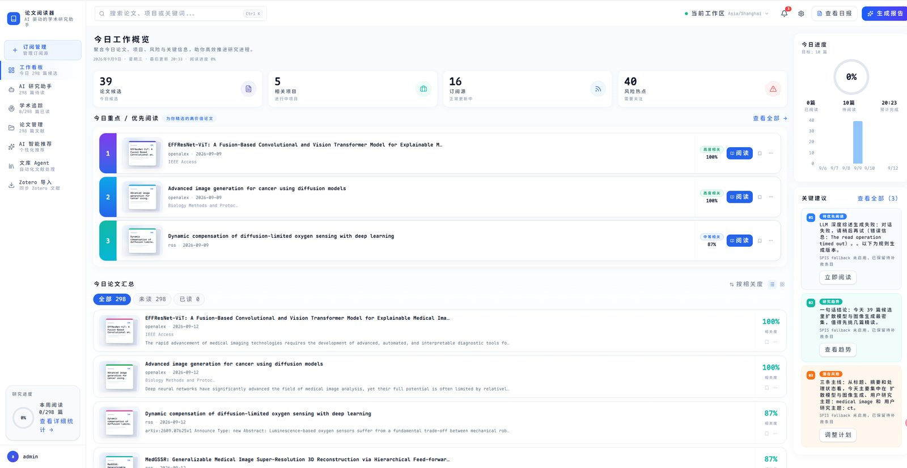
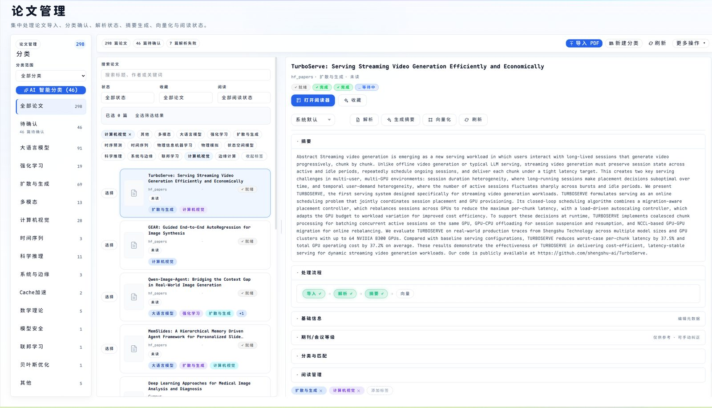
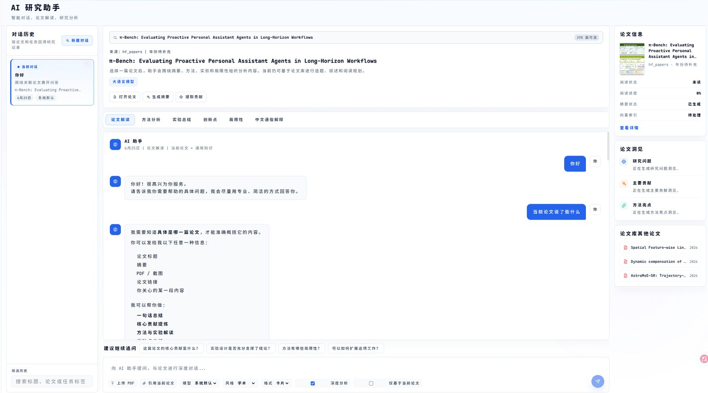
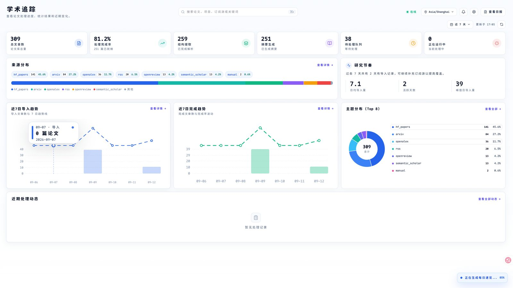
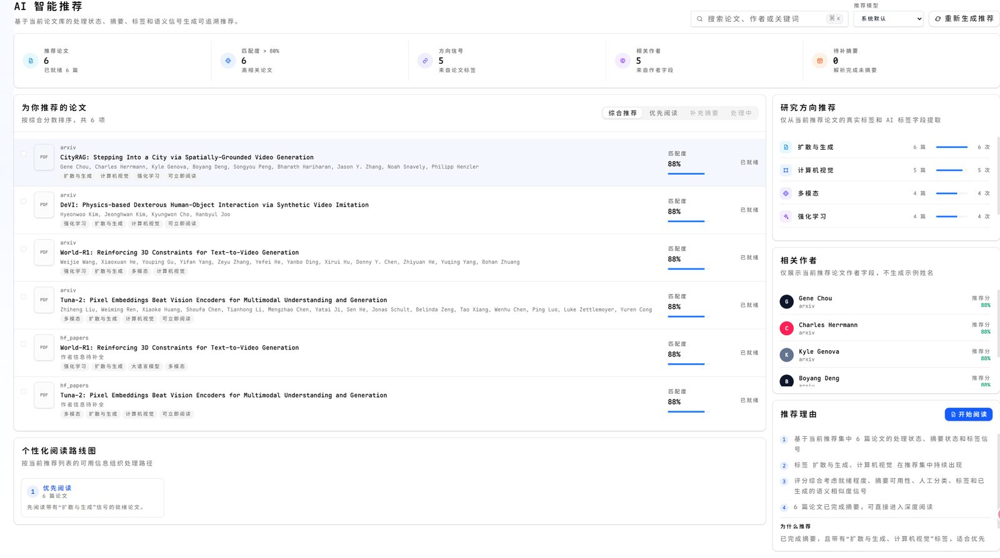

# Paper Reader Helper

本机优先的学术论文阅读与研究工作台：把订阅、文库、结构化阅读、AI 对话和每日简报放在同一条工作流里。

MinerU 解析与 DeepSeek 推理走 API，向量嵌入在本地完成。



## 能做什么

| 工作流 | 说明 |
|---|---|
| 导入与订阅 | arXiv / OpenAlex 等 11 个数据源、RSS、Zotero；订阅后持续入库。PDF 获取失败时走 SPIS 回退与手动补救。 |
| 文库与阅读 | 分类、标签、筛选、批量操作；PDF + Markdown 双窗格阅读，段落级翻译与笔记。 |
| AI 助手 | 单篇对话解读、文库 Agent（分类 / 标签 / 批量操作，支持审批与回滚）、个性化推荐。 |
| 看板与追踪 | 工作看板、每日简报、阅读 / 导入趋势与主题分布。 |










## 技术栈

| 层 | 技术 |
|---|---|
| 前端 | React 18 + TypeScript + Vite + Tailwind CSS + shadcn/ui |
| 后端 | FastAPI + SQLModel + SQLite |
| AI | DeepSeek（摘要 / 对话 / 推荐）+ MinerU（PDF 解析）+ BGE-M3（本地嵌入） |
| 运行 | 源码开发、Docker Compose、桌面模式（后端托管前端）；可选 Tauri 窗口，见 [DESKTOP.md](DESKTOP.md) |

## 快速开始

### 环境要求

- Node.js >= 18
- Python >= 3.12
- [uv](https://docs.astral.sh/uv/)

### 1. 克隆项目

```bash
git clone https://github.com/xdexcellent/paper-reader-helper.git
cd paper-reader-helper
```

### 2. 配置环境变量

```bash
cp .env.example .env
```

编辑 `.env`：

| 变量 | 说明 | 必填 |
|---|---|---|
| `MINERU_API_TOKEN` | MinerU PDF 解析 Token | 是 |
| `DEEPSEEK_API_KEY` | DeepSeek API Key | 是 |
| `JWT_SECRET` | JWT 签名密钥，请改成随机长串 | 是 |
| `APP_USERNAME` / `APP_PASSWORD` | 首次启动创建管理员账号 | 建议设置 |
| `DEEPSEEK_THINKING` | 思考强度：`none` / `low` / `medium` / `high` | 否 |
| `S2_API_KEY` | Semantic Scholar，提高请求限额 | 否 |
| `OPENALEX_EMAIL` | OpenAlex polite pool | 否 |

完整变量见 [`.env.example`](.env.example)。

### 3. 启动后端

```bash
cd backend
uv sync
uv run uvicorn app.main:app --host 0.0.0.0 --port 8000 --reload
```

### 4. 启动前端

```bash
cd frontend
npm install
npm run dev
```

浏览器打开 `http://localhost:3000`。

## 其他运行方式

### Docker Compose

```bash
docker compose up
```

应用入口：`http://localhost:8000`（镜像内后端托管前端静态文件）。

### 桌面模式（一键启动）

```bash
cd frontend && npm run build
cd .. && start.bat
```

后端托管 `frontend/dist`，浏览器打开 `http://localhost:8000`。独立窗口与打包见 [DESKTOP.md](DESKTOP.md)。

## 论文处理流水线

1. **PDF 解析** — MinerU 转为结构化 Markdown；获取失败时可 SPIS 回退
2. **AI 摘要** — DeepSeek 生成一行摘要、贡献与方法概述
3. **段落提取** — 抽出可定位的文档块
4. **段落翻译** — 按需翻译
5. **向量嵌入** — 本地 BGE-M3，供语义搜索
6. **自动分类** — 按研究方向归类

## 支持的数据源

arXiv · CrossRef · DBLP · GitHub Trending · Hugging Face Papers · OpenAlex · OpenReview · Papers With Code · RSS · Semantic Scholar · Unpaywall

## 项目结构

```
paper-reader-helper/
├── backend/app/          # FastAPI：路由、模型、论文流水线与数据源适配器
├── frontend/src/         # React：看板、文库、阅读器、对话、Agent、追踪
├── docs/screenshots/     # README 截图
├── docker-compose.yml
├── start.bat             # 桌面模式一键启动
└── .env.example
```

## 开发

```bash
cd frontend && npm run test
cd frontend && npm run build
cd backend && uv run pytest
```

## 相关文档

- [DESKTOP.md](DESKTOP.md) — 桌面模式与 Tauri 打包
- [DESIGN.md](DESIGN.md) — UI 设计系统

## License

MIT
